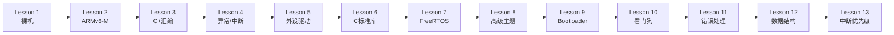
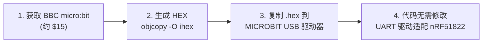

# ARM Cortex-M0 Embedded Learning

从零开始学习 ARM Cortex-M0 嵌入式开发 — 使用 QEMU 模拟 BBC micro:bit，无需物理硬件。

[](https://github.com/neluca/embedded-from-scratch/actions/workflows/build.yml)
[](LICENSE)

---

## 快速开始（5 分钟）

### 前提条件

| 工具 | 安装方式 |
|------|----------|
| **ARM GCC** | `sudo apt install gcc-arm-none-eabi`（Linux）或 [ARM Developer](https://developer.arm.com/downloads/-/gnu-rm) |
| **QEMU** | `sudo apt install qemu-system-arm`（Linux）或 [QEMU](https://www.qemu.org/download/) |
| **CMake + Ninja** | `sudo apt install cmake ninja-build` |

### 构建并运行

```bash
# 克隆（含 FreeRTOS 子模块）
git clone --recurse-submodules https://github.com/neluca/embedded-from-scratch.git
cd embedded-from-scratch

# 构建所有阶段
cmake -B build -S . -DCMAKE_TOOLCHAIN_FILE=cmake/arm-none-eabi-gcc.cmake -G Ninja
cmake --build build

# 运行 Lesson 1
qemu-system-arm -M microbit \
    -kernel build/lesson_01_bare_metal/lesson_01_bare_metal.elf \
    -semihosting -nographic
```

看到 `Hello Embedded World!` 就成功了！

### 设置 ARM GCC 前缀（可选）

如果 `arm-none-eabi-gcc` 不在 PATH 中：

```bash
# Linux/macOS
export ARM_GCC_PREFIX=/opt/arm-gcc/bin/arm-none-eabi-

# Windows (Git Bash)
export ARM_GCC_PREFIX=D:/Bin/arm/gcc-arm-none-eabi-10.3-2021.10/bin/arm-none-eabi-
```

---

## 为什么从 Cortex-M0 开始？

Cortex-M0 是 ARM 家族中最精简的处理器——**整个指令集只有 56 条指令**。这不是缺陷，而是一种优势。

### 用小指令集，学大道理

<pre>
 ARM 指令集复杂度对比:
 
 ARMv7-M (Cortex-M3/M4):  200+ 条指令  →  功能强大但难入门
 ARMv6-M (Cortex-M0/M0+):  56 条指令   →  <b>2 小时可学完全部指令</b>
</pre>

M0 的指令少，意味着你可以在极短时间内**看到全貌**。一旦掌握了 M0，向上迁移到 M3/M4/M7 就只是"多了些方便指令"——核心概念完全相通。这比从复杂的 M4 入手、被大量指令淹没效率高得多。

### 你将获得的能力

| 层级 | 技能 | 可迁移到 |
|------|------|----------|
| **指令层** | 手写 ARM 汇编、理解 AAPCS 调用约定、读懂反汇编 | 任何 ARM 芯片 (A 系列 / R 系列 / M 系列) |
| **芯片层** | NVIC 中断控制、SysTick/PendSV/SVC 异常、内存映射 I/O | Cortex-M0/M0+/M3/M4/M7/M23/M33 |
| **系统层** | 链接脚本、启动代码、newlib 移植、FreeRTOS 集成 | 所有嵌入式 RTOS 项目 |
| **工程层** | CMake 交叉编译、GDB 远程调试、QEMU 仿真、CI/CD | 通用嵌入式工程实践 |
| **可靠性层** | 看门狗策略、断言系统、栈溢出检测、CRC 校验、故障日志 | 工业/汽车/医疗等关键领域 |

### 举一反三

M0 上学到的**每一条原理**都可以直接用于更大的 ARM 芯片：

- M0 的 `ldr r0, [r1, #4]` → M4 的 `ldr r0, [r1, r2, lsl #2]` — 寻址模式更灵活，但**本质都是内存访问**
- M0 的 `CMP + B<cond>` → M4 的 `CBZ/CBNZ` + `IT` 块 — 多了捷径，但**分支逻辑不变**
- M0 的手动软件除法 → M4 的 `UDIV/SDIV` — 硬件帮你做了，但**除法原理不变**
- M0 无 VTOR → M4 有 VTOR — 多了一个寄存器，但**向量表概念完全一致**

> **学会 M0，你就学会了 ARM 世界最难的版本。** 没有硬件除法器、没有位域指令、没有 MPU——你必须自己实现一切。这恰恰让你理解了底层每一件事是如何工作的。往上走，那些"方便指令"只是锦上添花。

---

## 学习路径



| 阶段 | 你会学到 |
|------|----------|
| **[Lesson 1](lesson_01_bare_metal/)** | CMake 工具链、链接脚本、启动代码、Semihosting |
| **[Lesson 2](lesson_02_assembly/)** | ARMv6-M 指令集、寄存器、内存访问、栈、子程序 |
| **[Lesson 3](lesson_03_c_asm_integration/)** | AAPCS 调用约定、内联汇编、PRIMASK/临界区 |
| **[Lesson 4](lesson_04_exceptions_interrupts/)** | NVIC、SysTick、PendSV、HardFault 分析器 |
| **[Lesson 5](lesson_05_peripherals/)** | UART/GPIO/Timer 驱动、内存映射 I/O |
| **[Lesson 6](lesson_06_newlib/)** | C 运行时、syscall、printf/malloc、软件浮点 |
| **[Lesson 7](lesson_07_freertos/)** | 多任务调度、队列通信、上下文切换 |
| **[Lesson 8](lesson_08_advanced/)** | GDB 调试、优化分析、低功耗、生产部署 |
| **[Lesson 9](lesson_09_bootloader/)** | Bootloader + Application 双固件启动 |
| **[Lesson 10](lesson_10_watchdog/)** | WDT 看门狗、复位原因诊断、多点喂狗策略 |
| **[Lesson 11](lesson_11_error_handling/)** | 断言、栈溢出检测、错误码、CRC校验、故障日志 |
| **[Lesson 12](lesson_12_patterns/)** | 环形缓冲、状态机、位操作、COBS帧编码 |
| **[Lesson 13](lesson_13_interrupt_priority/)** | NVIC 优先级、中断抢占、临界区、优先级反转 |

每个阶段有独立的 `README.md` 包含详细说明。

---

## Cortex-M0 vs M0+

本项目目标为 **Cortex-M0**，同时说明其与 M0+ 的区别：

| 特性 | Cortex-M0 | Cortex-M0+ |
|------|-----------|------------|
| **指令集** | ARMv6-M (Thumb-1) | ARMv6-M (Thumb-1) — 完全相同 |
| **流水线** | 3 级 | 2 级（更快中断响应） |
| **MPU** | 无 | 可选 |
| **VTOR** | 无（向量表固定在 0x00000000） | 可选 |
| **I/O 端口** | 标准总线访问 | 单周期 I/O 端口 |
| **WFE/SEV** | 支持（指令存在，无外部事件信号） | 支持（含 TXEV/RXEV 外部事件接口） |

> 两者使用相同指令集，本项目代码同时适用于 M0 和 M0+。QEMU 使用 `cortex-m0` CPU 模型。

---

## 项目结构

```
embedded-from-scratch/
├── .github/workflows/             # CI/CD 自动化
│   └── build.yml
├── cmake/
│   ├── arm-none-eabi-gcc.cmake    # CMake 工具链文件
│   └── qemu_run.cmake             # QEMU 运行目标
├── scripts/
│   ├── build.sh                   # 构建脚本
│   ├── run_qemu.sh                # QEMU 运行脚本
│   └── debug.gdb                  # GDB 调试脚本
├── docs/                          # 参考文档（工具链、ELF、汇编、FreeRTOS...）
├── lesson_01_bare_metal/           # 13 个学习阶段
├── lesson_02_assembly/
├── lesson_03_c_asm_integration/
├── lesson_04_exceptions_interrupts/
├── lesson_05_peripherals/
├── lesson_06_newlib/
├── lesson_07_freertos/
├── lesson_08_advanced/
├── lesson_09_bootloader/
├── lesson_10_watchdog/
├── lesson_11_error_handling/
├── lesson_12_patterns/
├── lesson_13_interrupt_priority/  # 13 个学习阶段
├── CMakeLists.txt                 # 根构建文件
├── .clang-format                  # 代码格式化规则
├── LICENSE                        # MIT
└── CONTRIBUTING.md                # 贡献指南
```

---

## 构建单个阶段

```bash
# 使用脚本（推荐）
bash scripts/build.sh lesson_01_bare_metal Debug

# 或手动 CMake（使用 out-of-source 构建目录）
cmake -B /tmp/learn-build/lesson_01 -S lesson_01_bare_metal \
    -DCMAKE_TOOLCHAIN_FILE=cmake/arm-none-eabi-gcc.cmake -G Ninja
cmake --build /tmp/learn-build/lesson_01
```

## 在 QEMU 中运行

每个阶段自动生成 CMake 运行目标：

```bash
# 配置（生成 QEMU 运行目标）
cmake -B /tmp/learn-build/lesson_01 -S lesson_01_bare_metal \
    -DCMAKE_TOOLCHAIN_FILE=cmake/arm-none-eabi-gcc.cmake -G Ninja
cmake --build /tmp/learn-build/lesson_01

# 运行（QEMU semihosting 模式，ELF 文件）
cmake --build /tmp/learn-build/lesson_01 --target run_lesson_01_bare_metal

# 运行 Release 版本（raw binary，无 semihosting，通过 UART 输出）
cmake -B /tmp/learn-build/lesson_01_rel -S lesson_01_bare_metal \
    -DCMAKE_TOOLCHAIN_FILE=cmake/arm-none-eabi-gcc.cmake \
    -DCMAKE_BUILD_TYPE=Release -G Ninja
cmake --build /tmp/learn-build/lesson_01_rel
cmake --build /tmp/learn-build/lesson_01_rel --target run_bin_lesson_01_bare_metal

# GDB 调试模式（端口 1234，CPU 暂停）
cmake --build /tmp/learn-build/lesson_01 --target debug_lesson_01_bare_metal

# GDB 调试模式（CPU 运行中，可随时 attach）
cmake --build /tmp/learn-build/lesson_01 --target debug_continue_lesson_01_bare_metal
```

每个阶段有四个 CMake 目标：

| 目标 | 加载文件 | 适用场景 |
|------|---------|----------|
| `run_<name>` | `.elf` + semihosting | Debug 开发，看 semihosting 输出 |
| `run_bin_<name>` | `.bin` (raw binary) | Release 测试，模拟真实烧录 |
| `debug_<name>` | `.elf` + GDB 暂停 | 从第一条指令开始调试 |
| `debug_continue_<name>` | `.elf` + GDB 运行中 | Attach 到正在运行的程序 |

> 在 CLion 中，打开任意阶段的 `CMakeLists.txt` 作为项目，CMake 配置后 Run Configurations 下拉菜单中会自动出现这些目标，选择后可直接点击运行按钮在 CLion 终端中看到 QEMU 输出。

## 构建产物

每个阶段的 `build/Debug/` 目录下：

| 文件 | 用途 |
|------|------|
| `*.elf` | 可执行文件（QEMU 加载） |
| `*.disasm` | 反汇编 + 源码（学习编译器输出） |
| `*.map` | 内存映射文件（分析内存使用） |
| `*.hex` | Intel HEX 格式（真实硬件烧录） |

---

## QEMU 调试

```bash
# Terminal 1 — 启动 QEMU（暂停等待调试器）
bash scripts/run_qemu.sh lesson_01_bare_metal/build/Debug/lesson_01_bare_metal.elf --gdb-pause

# Terminal 2 — 连接 GDB
arm-none-eabi-gdb lesson_01_bare_metal/build/Debug/lesson_01_bare_metal.elf -x scripts/debug.gdb
```

---

## 从 QEMU 到真实硬件



---

## 文档

| 指南 | 内容 |
|------|------|
| [GNU 工具链](docs/00_toolchain.md) | gcc, as, ld, objdump, size, gdb 使用方法 |
| [ELF 格式](docs/01_elf_format.md) | Section、VMA/LMA、内存布局 |
| [汇编指南](docs/02_assembly.md) | ARMv6-M 指令集、寄存器、Thumb-1 约束 |
| [链接脚本](docs/03_linker_script.md) | MEMORY, SECTIONS, 栈/堆定义 |
| [newlib-nano](docs/04_newlib_nano.md) | syscall 接口、printf/malloc 调用链 |
| [FreeRTOS](docs/05_freertos.md) | 任务、调度器、PendSV、队列 |
| [QEMU 详解](docs/06_qemu.md) | 安装、参数、Semihosting 原理、GDB 调试 |

[文档索引 →](docs/README.md)

---

## 外部参考

- [ARMv6-M Architecture Reference Manual](https://developer.arm.com/documentation/ddi0419/)
- [nRF51822 Product Specification](https://infocenter.nordicsemi.com/pdf/nRF51822_PS_v3.3.pdf)
- [ARM Semihosting Specification](https://developer.arm.com/documentation/100863/)
- [FreeRTOS Kernel](https://github.com/FreeRTOS/FreeRTOS-Kernel)
- [QEMU ARM System Emulation](https://www.qemu.org/docs/master/system/arm/microbit.html)

## 许可证

MIT — 详见 [LICENSE](LICENSE)

