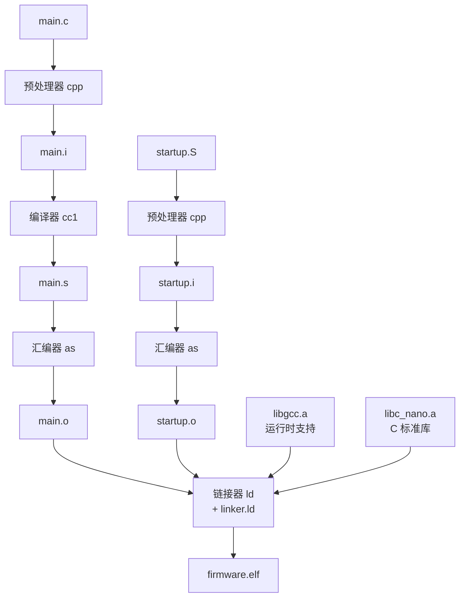

# GNU ARM Embedded Toolchain Guide

## 什么是工具链？

工具链是一组程序的集合，把人类可读的源代码转换成微控制器能执行的机器码。


---

## 工具链组件详解

### arm-none-eabi-gcc — 编译器驱动程序

`gcc` 是 GNU Compiler Collection 的核心。对于 ARM 嵌入式开发，使用 `arm-none-eabi-gcc`。

| 后缀 | 含义 |
|------|------|
| `arm` | 目标架构：ARM |
| `none` | 无操作系统（bare-metal） |
| `eabi` | Embedded Application Binary Interface（嵌入式 ABI） |

**常用命令：**

```bash
# 编译 C 文件到目标文件
arm-none-eabi-gcc -mcpu=cortex-m0 -mthumb -c main.c -o main.o

# 编译 + 汇编 + 链接 一步完成
arm-none-eabi-gcc -mcpu=cortex-m0 -mthumb -T linker.ld main.c -o firmware.elf

# 仅预处理（展开宏和头文件）
arm-none-eabi-gcc -mcpu=cortex-m0 -mthumb -E main.c -o main.i

# 编译到汇编（不汇编）
arm-none-eabi-gcc -mcpu=cortex-m0 -mthumb -S main.c -o main.s
```

**常用编译选项：**

| 选项 | 说明 |
|------|------|
| `-mcpu=cortex-m0` | 目标 CPU：Cortex-M0（ARMv6-M） |
| `-mthumb` | 使用 Thumb 指令集（M0 仅支持 Thumb） |
| `-O0` | 无优化（调试用） |
| `-Os` | 优化代码大小（嵌入式常用） |
| `-O2` | 优化速度 |
| `-g3` | 生成调试信息（最详细级别） |
| `-Wall -Wextra` | 启用所有警告 |
| `-ffunction-sections` | 每个函数放入独立 section |
| `-fdata-sections` | 每个变量放入独立 section |
| `-ffreestanding` | 独立环境（无宿主 OS） |
| `-nostdlib` | 不链接标准库 |
| `-specs=nano.specs` | 使用 newlib-nano 精简 C 库 |

---

### arm-none-eabi-as — 汇编器

将汇编源码 `.s` / `.S` 转换为目标文件 `.o`。

```bash
# 预处理 + 汇编
arm-none-eabi-gcc -mcpu=cortex-m0 -mthumb -c startup.S -o startup.o
```

`.s` vs `.S` 的区别：

| 扩展名 | 预处理 |
|--------|--------|
| `.s` | 不经过 C 预处理器 |
| `.S` | 先经过 C 预处理器（支持 `#define`, `#include`, `/* 注释 */`） |

---

### arm-none-eabi-ld — 链接器

将多个 `.o` 文件和库合并为一个可执行文件 `.elf`。

```bash
arm-none-eabi-ld -T linker.ld main.o startup.o -o firmware.elf
```

通常不直接调用 `ld`，而是通过 `gcc` 调用（gcc 会自动传递正确的库路径）。

**常用链接选项：**

| 选项 | 说明 |
|------|------|
| `-T<script>` | 指定链接脚本 |
| `-nostdlib` | 不链接标准库 |
| `-nostartfiles` | 不链接标准启动文件 |
| `-Wl,--gc-sections` | 移除未使用的 section |
| `-Wl,-Map=file.map` | 生成内存映射文件 |
| `-Wl,--print-memory-usage` | 打印内存使用情况 |

---

### arm-none-eabi-objdump — 反汇编器

查看 ELF 文件的内容，是理解编译结果的核心工具。

```bash
# 反汇编（带源码混合）
arm-none-eabi-objdump -d -S firmware.elf

# 完整反汇编（所有 section）
arm-none-eabi-objdump -D firmware.elf

# 显示 section 头信息
arm-none-eabi-objdump -h firmware.elf

# 显示符号表
arm-none-eabi-objdump -t firmware.elf
```

**阅读反汇编示例：**

```asm
000000c4 <main>:
  c4:   b580        push    {r7, lr}        @ 保存 r7 和返回地址
  c6:   b086        sub     sp, #24         @ 分配 24 字节栈空间
  ...
  fe:   4770        bx      lr              @ 返回
```

- 第一列：地址（Flash 中的位置）
- 第二列：机器码（16 位或 32 位）
- 后面：汇编指令（人类可读）

---

### arm-none-eabi-objcopy — 格式转换器

将 ELF 文件转换为其他格式。

```bash
# 生成 Intel HEX（用于烧录）
arm-none-eabi-objcopy -O ihex firmware.elf firmware.hex

# 生成 raw binary（纯机器码）
arm-none-eabi-objcopy -O binary firmware.elf firmware.bin
```

**输出格式对比：**

| 格式 | 内容 | 用途 |
|------|------|------|
| ELF | 完整程序（含调试信息、符号表、section 信息） | 调试、QEMU |
| HEX | 文本格式，含地址信息 | 烧录（Intel HEX） |
| BIN | 纯二进制，无地址信息 | 烧录（raw binary） |

---

### arm-none-eabi-size — 大小分析

```bash
arm-none-eabi-size firmware.elf
# 输出: text    data    bss     dec     hex    filename
#       7472    0       0       7472    1d30   firmware.elf
```

| 列 | 含义 | 存储位置 |
|----|------|----------|
| `text` | 代码 + 只读数据 | Flash |
| `data` | 已初始化变量 | Flash（初始值）+ RAM（运行时，启动时复制） |
| `bss` | 未初始化变量（启动时清零） | RAM |
| `dec` | text + data + bss | — |
| `hex` | 十六进制 | — |

---

### arm-none-eabi-nm — 符号查看器

```bash
# 列出所有符号
arm-none-eabi-nm firmware.elf

# 按大小排序
arm-none-eabi-nm --size-sort firmware.elf
```

符号表中 `T` = 代码（text），`D` = 已初始化数据，`B` = BSS，`U` = 未定义（需要链接）。

---

### arm-none-eabi-gdb — 调试器

```bash
# 启动 GDB
arm-none-eabi-gdb firmware.elf

# 连接到 QEMU GDB 服务器
(gdb) target remote localhost:1234

# 常用命令
(gdb) info registers          # 查看寄存器
(gdb) x/10x $sp               # 查看栈
(gdb) disas /m                # 反汇编（混合源码）
(gdb) break main              # 设置断点
(gdb) continue                # 继续执行
(gdb) stepi                   # 单步执行一条指令
```

---

## 编译流程详解



### 每个阶段做了什么：

| 阶段 | 输入 | 输出 | 做了什么 |
|------|------|------|----------|
| **预处理** | `.c` | `.i` | 展开 `#include`、`#define` 宏、去除注释 |
| **编译** | `.i` | `.s` | C -> 汇编代码 |
| **汇编** | `.s` | `.o` | 汇编 -> 机器码 + 符号信息 |
| **链接** | `.o` + `.a` | `.elf` | 合并目标文件、解析符号、分配地址 |

---

## 交叉编译 vs 本地编译

| | 本地编译 | 交叉编译 |
|------|----------|-----------|
| **编译机器** | x86_64 PC | x86_64 PC |
| **目标机器** | x86_64 PC | ARM Cortex-M0 |
| **编译器** | `gcc` | `arm-none-eabi-gcc` |
| **可执行** | 可在 PC 上运行 | 只能在 ARM 目标硬件上运行（或用 QEMU 模拟） |

交叉编译的核心挑战：编译出来的程序不能在编译机器上运行，必须下载到目标硬件或用模拟器运行。

---

## 常见问题

### Q: `undefined reference to __aeabi_uidiv`

Cortex-M0 没有硬件除法器。使用 `/` 或 `%` 运算符时需要链接 `libgcc`：`-lgcc`。

### Q: `cannot find entry symbol _start`

没有定义入口点。在链接脚本中使用 `ENTRY(reset_handler)` 或在代码中定义 `_start`。

### Q: `selected processor does not support`

使用了 Thumb-2 专属指令（如 `ITT`, `CBZ` 等在某些 GAS 版本中不被 cortex-m0 支持）。解决方案：使用 CMP + 条件分支代替，或使用 `.syntax unified`。

### Q: section `.bss' will not fit in region `ram'

RAM 空间不足。检查：全局变量大小、栈大小、堆大小，或优化数据结构。

---

## 延伸阅读

- [GCC ARM Options](https://gcc.gnu.org/onlinedocs/gcc/ARM-Options.html)
- [GNU Binutils Documentation](https://sourceware.org/binutils/docs/)
- [ARM EABI Specification](https://developer.arm.com/documentation/ihi0045/)
