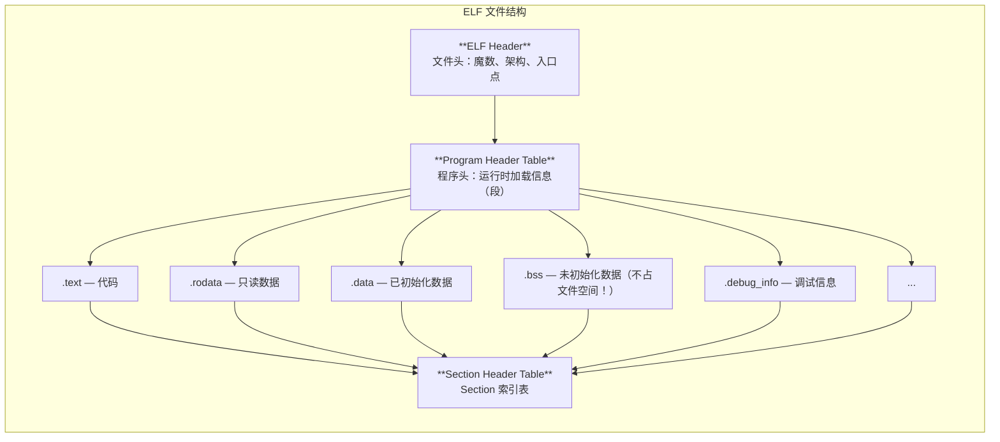
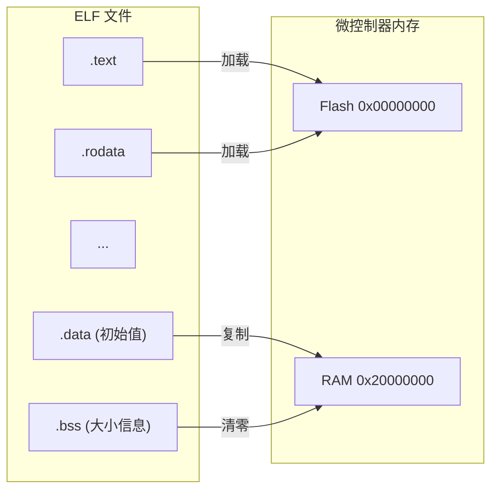
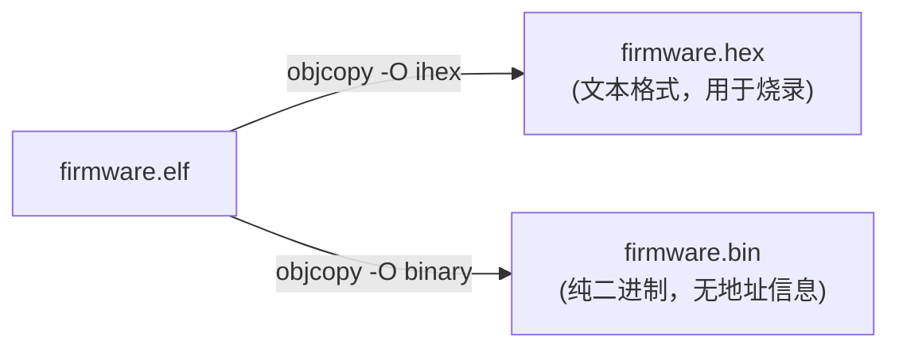
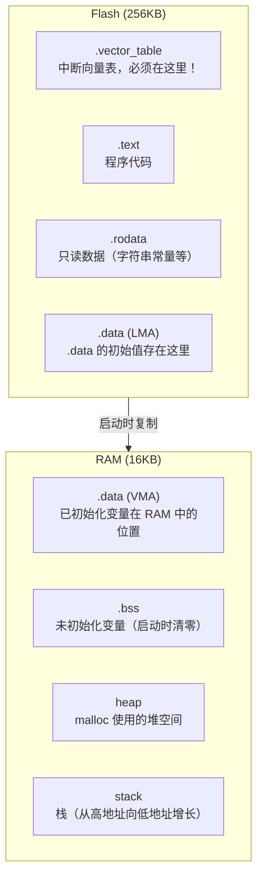

# ELF 文件格式指南

## 什么是 ELF？

**ELF**（Executable and Linkable Format）是嵌入式系统中最常用的可执行文件格式。你的 `firmware.elf` 就是 ELF 格式。



---

## ELF 如何变成嵌入式程序



启动代码（startup.S）负责：
1. 将 `.data` 的初始值从 Flash 复制到 RAM
2. 将 `.bss` 在 RAM 中清零
3. 设置栈指针
4. 跳转到 `main()`

---

## 用 objdump 探索 ELF

### 查看 Section 头

```bash
arm-none-eabi-objdump -h firmware.elf
```

输出示例：

```
Sections:
Idx Name          Size      VMA       LMA       File off  Algn
  0 .vector_table 000000c4  00000000  00000000  00010000  2**2
  1 .text         000065d4  000000c4  000000c4  000100c4  2**2
  2 .rodata       00000de4  00006698  00006698  00016698  2**3
  3 .data         00000068  20000000  0000747c  00020000  2**2
  4 .bss          00000010  20000068  000074e4  00020068  2**2
```

列说明：

| 列 | 含义 |
|----|------|
| **Idx** | Section 编号 |
| **Name** | Section 名称 |
| **Size** | 大小（十六进制字节数） |
| **VMA** | 虚拟内存地址（运行时地址） |
| **LMA** | 加载内存地址（存储地址） |
| **File off** | 在 ELF 文件中的偏移 |

**关键观察：**
- `.vector_table` 在 VMA `0x00000000`（Cortex-M 复位向量起始地址）✓
- `.text` 和 `.rodata` 的 VMA = LMA（都在 Flash 中，不需要复制）✓
- `.data` 的 VMA = `0x20000000`（RAM），LMA = `0x0000747c`（Flash）— 需要复制！
- `.bss` 的 VMA = `0x20000068`（RAM），在文件中不占空间

---

### 查看 Section 内容

```bash
arm-none-eabi-objdump -s -j .vector_table firmware.elf
```

输出（向量表的前 16 个字节）：

```
Contents of section .vector_table:
 0000 00400020 c5000000 f3000000 f5000000   .@. ............
```

- `00400020` = 0x20004000（初始 SP，小端序）
- `c5000000` = 0x000000C5 = reset_handler 地址（bit0=1 表示 Thumb 状态）
- `f3000000` = 0x000000F3 = NMI handler（默认死循环）

---

### 查看符号表

```bash
arm-none-eabi-nm firmware.elf | head -20
```

常见符号类型：

| 类型 | 含义 |
|------|------|
| `T` | Text section（代码中的全局函数） |
| `t` | Text section（代码中的局部函数） |
| `D` | Data section（已初始化的全局变量） |
| `B` | BSS section（未初始化的全局变量） |
| `U` | Undefined（需要从其他文件或库导入） |
| `W` | Weak symbol（可被覆盖的弱符号） |

---

## ELF 和 HEX/BIN 的关系



**什么时候用什么格式：**

| 工具 | 格式 | 原因 |
|------|------|------|
| QEMU | ELF | QEMU 需要符号表来定位 semihosting 调用 |
| GDB | ELF | 需要调试信息（`-g3` 编译选项） |
| 烧录器 | HEX | 含地址信息，烧录器能定位到正确的 Flash 地址 |
| Bootloader | BIN | 简单，固定地址烧录 |

---

## Cortex-M0 内存布局回顾



---

## 使用 readelf 获取更详细的信息

```bash
# ELF 文件头
arm-none-eabi-readelf -h firmware.elf

# Section 详细信息
arm-none-eabi-readelf -S firmware.elf

# 符号表
arm-none-eabi-readelf -s firmware.elf

# 程序头
arm-none-eabi-readelf -l firmware.elf
```

---

## 小结

- **ELF** 是嵌入式开发的标准可执行格式
- **Section** 是 ELF 的组织单元（`.text`, `.data`, `.bss` 等）
- **VMA vs LMA** 是关键概念：`.data` 的 VMA（RAM）和 LMA（Flash）不同
- **启动代码** 负责把 `.data` 从 Flash 复制到 RAM，把 `.bss` 清零
- 使用 `objdump`, `size`, `nm`, `readelf` 深入理解你的程序
