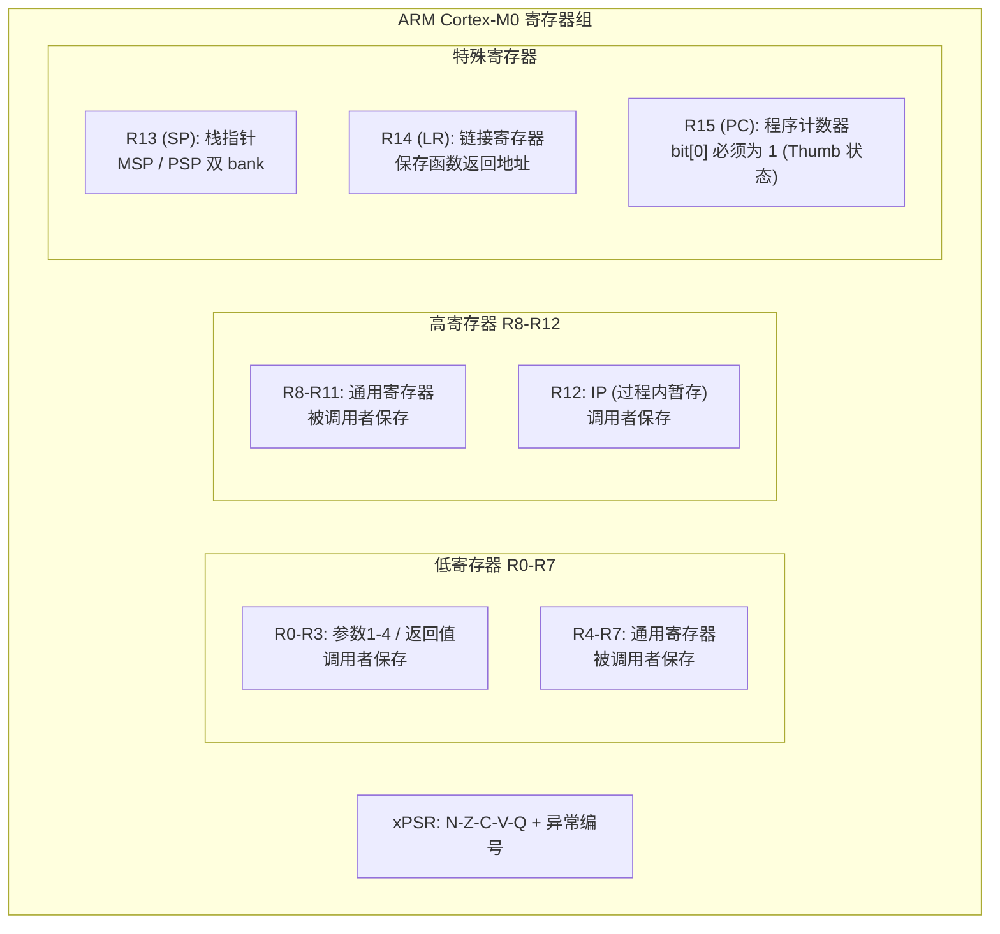
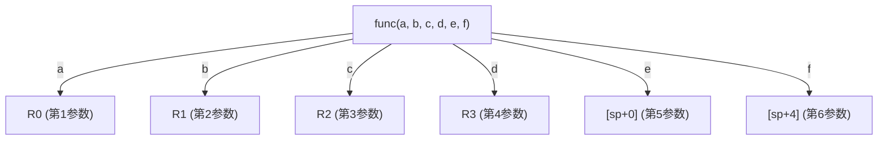

# ARM Cortex-M0 汇编指南

## 架构概览

Cortex-M0 使用 **ARMv6-M** 架构，仅支持 **Thumb-1** 指令集（56 条指令，16 位编码为主）。

> **Thumb-1 vs Thumb-2**: Thumb-2（ARMv7-M，如 Cortex-M3/M4）新增了约 100 条 32 位指令。M0 的指令集是它的子集。

---

## 寄存器组



### 关键约束

| 限制 | 说明 |
|------|------|
| **低寄存器** R0-R7 | 可用于所有指令 |
| **高寄存器** R8-R12 | 仅 MOV/ADD/CMP/BX 可使用 |
| **Thumb 状态** | PC 的 bit[0] 必须始终为 1 |
| **2 操作数** | 大部分 ALU 指令只有 `OP Rd, Rm`（Rd=Rd op Rm） |
| **3 操作数** | 不存在于 Thumb-1！`ADD Rd, Rn, Rm` 是 Thumb-2 指令 |

---

## 指令分类速查

### 数据传送

| 指令 | 语法 | 说明 | 周期 |
|------|------|------|------|
| `MOVS` | `MOVS Rd, #imm8` | 加载 8 位立即数（0-255） | 1 |
| `MOVS` | `MOVS Rd, Rm` | 寄存器间传送 | 1 |
| `MOV` | `MOV Rd, Rm` | 高低寄存器间传送 | 1 |
| `MVNS` | `MVNS Rd, Rm` | 按位取反传送 | 1 |
| `LDR` | `LDR Rd, =value` | 加载 32 位立即数（伪指令） | 2-3 |

### 算术运算

| 指令 | 语法 | 说明 |
|------|------|------|
| `ADDS` | `ADDS Rd, Rm` | Rd = Rd + Rm |
| `ADDS` | `ADDS Rd, #imm` | Rd = Rd + imm（3 或 8 位） |
| `SUBS` | `SUBS Rd, Rm` | Rd = Rd - Rm |
| `ADCS` | `ADCS Rd, Rm` | Rd = Rd + Rm + Carry（64 位加法） |
| `MULS` | `MULS Rd, Rm` | Rd = Rd * Rm（32 位结果） |
| `CMP` | `CMP Rn, Rm` | 比较（Rn - Rm，只更新标志） |

> **M0 没有硬件除法！** `/` 和 `%` 需要软件实现（libgcc 的 `__aeabi_uidiv`）。

### 逻辑运算

| 指令 | 语法 | 说明 |
|------|------|------|
| `ANDS` | `ANDS Rd, Rm` | Rd = Rd & Rm |
| `ORRS` | `ORRS Rd, Rm` | Rd = Rd \| Rm |
| `EORS` | `EORS Rd, Rm` | Rd = Rd ^ Rm |
| `BICS` | `BICS Rd, Rm` | Rd = Rd & ~Rm（清零指定位） |
| `TST` | `TST Rn, Rm` | Rn & Rm（测试位，只更新标志） |

### 移位操作

| 指令 | 语法 | 说明 |
|------|------|------|
| `LSLS` | `LSLS Rd, Rm, #n` | Rd = Rm << n |
| `LSRS` | `LSRS Rd, Rm, #n` | 逻辑右移（高位补 0） |
| `ASRS` | `ASRS Rd, Rm, #n` | 算术右移（高位补符号位） |
| `RORS` | `RORS Rd, Rs` | 循环右移（移位量在寄存器中） |

### 分支指令

| 指令 | 语法 | 说明 | 范围 |
|------|------|------|------|
| `B` | `B label` | 无条件跳转 | ±2KB |
| `B<cc>` | `BEQ label` | 条件跳转 | ±256B |
| `BL` | `BL func` | 调用子程序（LR = 返回地址） | ±16MB |
| `BX` | `BX Rm` | 寄存器间接跳转 | 任意 |
| `BLX` | `BLX Rm` | 寄存器间接调用 | 任意 |

**条件码：**

| 后缀 | 条件 | 标志位 |
|------|------|--------|
| `EQ` | 等于 | Z = 1 |
| `NE` | 不等于 | Z = 0 |
| `CS` / `HS` | 进位 / 无符号 >= | C = 1 |
| `CC` / `LO` | 无进位 / 无符号 < | C = 0 |
| `MI` | 负数 | N = 1 |
| `PL` | 正数或零 | N = 0 |
| `GE` | 有符号 >= | N = V |
| `LT` | 有符号 < | N ≠ V |

### 内存访问

| 指令 | 语法 | 说明 |
|------|------|------|
| `LDR` | `LDR Rd, [Rn, #imm]` | 加载 32 位字，偏移 0-124 |
| `STR` | `STR Rd, [Rn, #imm]` | 存储 32 位字 |
| `LDRB` | `LDRB Rd, [Rn, #imm]` | 加载字节 |
| `STRB` | `STRB Rd, [Rn, #imm]` | 存储字节 |
| `LDRH` | `LDRH Rd, [Rn, #imm]` | 加载半字（16 位） |
| `STRH` | `STRH Rd, [Rn, #imm]` | 存储半字 |
| `LDMIA` | `LDMIA Rn!, {regs}` | 多寄存器加载 |
| `STMIA` | `STMIA Rn!, {regs}` | 多寄存器存储 |

### 栈操作

| 指令 | 等价操作 | 说明 |
|------|----------|------|
| `PUSH {regs}` | `STMDB SP!, {regs}` | 压栈（SP 先减后存） |
| `POP {regs}` | `LDMIA SP!, {regs}` | 出栈（先取后加 SP） |
| `PUSH {lr}` | — | 保存返回地址 |
| `POP {pc}` | — | 函数返回（PC = 弹出的值） |

### 杂项

| 指令 | 说明 |
|------|------|
| `NOP` | 空操作（1 周期） |
| `BKPT #imm` | 断点 / semihosting 调用 |
| `WFI` | 等待中断（低功耗休眠） |
| `WFE` | 等待事件 |
| `SEV` | 发送事件 |
| `CPSID i` | 关中断（设置 PRIMASK） |
| `CPSIE i` | 开中断（清除 PRIMASK） |
| `MRS` | 读特殊寄存器（PRIMASK, CONTROL） |
| `MSR` | 写特殊寄存器 |
| `SVC #imm` | 超级用户调用（FreeRTOS 启动第一个任务） |

---

## AAPCS 调用约定

**ARM Architecture Procedure Call Standard** — C 和汇编互操作的基础。

### 参数传递



- 前 4 个 32 位参数通过 **R0-R3** 传递
- 第 5+ 个参数通过**栈**传递
- 64 位参数占用两个寄存器（如 R0-R1）
- 返回值：32 位在 **R0**，64 位在 **R0-R1**

### 寄存器保存约定

| 寄存器 | 类别 | 说明 |
|--------|------|------|
| R0-R3 | **调用者保存** | 函数可以自由修改，调用者负责保存 |
| R4-R11 | **被调用者保存** | 函数如使用必须先 PUSH，返回前 POP |
| R12 | 调用者保存 | 过程内暂存器 |
| R13/SP | 被调用者保存 | 栈必须 8 字节对齐（公共接口处） |
| R14/LR | 调用者保存 | BL 自动保存返回地址 |
| R15/PC | — | 程序计数器 |

---

## 汇编文件基本结构

```asm
    .syntax unified        @ 使用 UAL 统一汇编语法
    .cpu    cortex-m0      @ 目标 CPU
    .thumb                 @ Thumb 模式

    .section .vector_table, "a"    @ 向量表 section
    .align  2                      @ 4 字节对齐

    .global reset_handler          @ 导出符号
    .thumb_func                    @ 标记为 Thumb 函数
    .type   reset_handler, %function
reset_handler:
    @ ... 代码 ...

    .section .rodata, "a"          @ 只读数据
msg_hello:
    .asciz "Hello\n"               @ NUL 结尾字符串

    .end
```

---

## 常见陷阱

| 问题 | 原因 | 解决 |
|------|------|------|
| `error: cannot honor width suffix` | 对高寄存器使用了仅支持低寄存器的指令 | 换用 R0-R7 |
| `instruction not supported in Thumb16 mode` | `.syntax divided` 模式下的 2 操作数指令被误判 | 加 `.syntax unified` |
| `address calculation needs a strongly defined nearby symbol` | ADR 跨 section 引用 | 换 `LDR Rd, =symbol` |
| `invalid immediate: NNN is out of range` | MOVS 立即数超过 255 | 换 `LDR Rd, =NNN` |
| `r13 not allowed here` | 对 SP 使用了 MOVS | 换 `MOV Rd, SP`（无 S 后缀） |

---

## M0 没有的常用指令

这些指令存在于 Cortex-M3/M4，在 M0 上需要软件实现：

| 缺失指令 | 功能 | M0 替代方案 |
|------|------|-------------|
| `UDIV` / `SDIV` | 硬件除法 | `__aeabi_uidiv`（libgcc） |
| `CLZ` | 前导零计数 | 循环 + TST |
| `REV` / `REV16` | 字节序反转 | AND + LSL + ORR 组合 |
| `RBIT` | 位反转 | 循环移位 |
| `BFI` / `UBFX` / `SBFX` | 位域操作 | AND + LSL + LSR 组合 |
| `ITT` / `ITEE` 等 | IT 块（部分 GAS 版本） | CMP + 分支 |
| `CBZ` / `CBNZ` | 零值跳转（部分 GAS 版本） | CMP + BEQ/BNE |
| `TBB` / `TBH` | 跳转表 | if-else 链 |
| `DSB` / `ISB` | 内存屏障 | 编译器屏障（M0 简单流水线不必要） |
