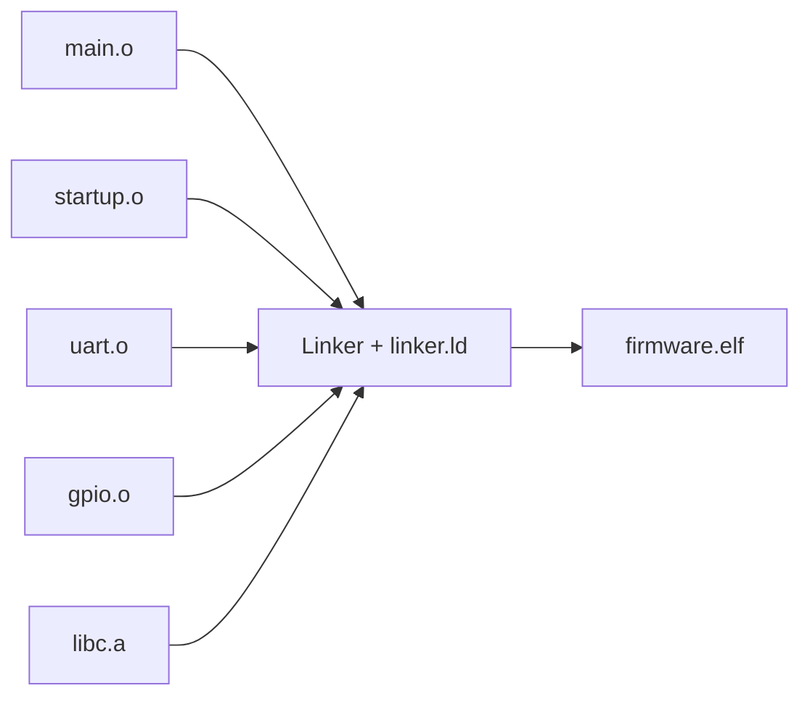
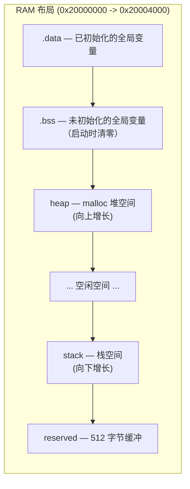

# Linker Script 链接脚本指南

## 什么是链接脚本？

链接脚本告诉链接器如何把多个 `.o` 文件合并成一个 `.elf` 文件，以及如何将程序的各个部分放置在内存中。



---

## 基本结构

```ld
/* 1. 定义内存区域 */
MEMORY
{
    flash (rx)  : ORIGIN = 0x00000000, LENGTH = 256K
    ram   (rwx) : ORIGIN = 0x20000000, LENGTH = 16K
}

/* 2. 定义入口点 */
ENTRY(reset_handler)

/* 3. 定义 Section 布局 */
SECTIONS
{
    .vector_table : { ... } > flash
    .text         : { ... } > flash
    .rodata       : { ... } > flash
    .data         : { ... } > ram AT > flash
    .bss          : { ... } > ram
}
```

---

## MEMORY 块详解

```ld
MEMORY
{
    flash (rx)  : ORIGIN = 0x00000000, LENGTH = 256K
    ram   (rwx) : ORIGIN = 0x20000000, LENGTH = 16K
}
```

| 字段 | 含义 |
|------|------|
| `flash` | 内存区域名称（自定义） |
| `(rx)` | 权限：读(r)、执行(x)、写(w) |
| `ORIGIN` | 起始地址 |
| `LENGTH` | 大小（K=1024, M=1024×1024） |

### 访问属性说明

| 属性 | 含义 | 适用 |
|------|------|------|
| `r` | 可读 | Flash、RAM |
| `w` | 可写 | RAM |
| `x` | 可执行 | Flash（代码） |

---

## SECTIONS 详解

### .vector_table — 中断向量表

```ld
.vector_table :
{
    KEEP(*(.vector_table))   /* KEEP 防止被 --gc-sections 删除 */
    . = ALIGN(4);
} > flash
```

**Cortex-M0 要求**：向量表必须位于 Flash 起始地址 `0x00000000`。`KEEP` 确保即使没有代码引用向量表，链接器也不会删除它。

### .text — 程序代码

```ld
.text :
{
    *(.text .text.*)     /* 所有文件的 .text section */
    *(.glue_7)           /* ARM-Thumb 转换桩 */
    *(.glue_7t)          /* Thumb-ARM 转换桩 */
    . = ALIGN(4);
} > flash
```

- `*(.text .text.*)` 收集所有 `.text` 和 `.text.funcname` section
- `.glue_7` / `.glue_7t` 用于 ARM 和 Thumb 状态间的切换（M0 不需要，仅为兼容保留）

### .rodata — 只读数据

```ld
.rodata :
{
    *(.rodata .rodata.*)   /* const 变量、字符串常量 */
    . = ALIGN(4);
} > flash
```

`> flash` 表示放在 Flash 中（只读，不占 RAM）。

### .data — 已初始化数据

```ld
.data :
{
    __data_start = .;        /* VMA：RAM 起始地址 */
    *(.data .data.*)         /* 全局/静态已初始化变量 */
    . = ALIGN(4);
    __data_end = .;          /* VMA：RAM 结束地址 */
} > ram AT > flash

__data_load_start = LOADADDR(.data);  /* LMA：Flash 中的地址 */
```

**关键概念**：`.data` 有两套地址！

| 符号 | 地址 | 含义 |
|------|------|------|
| `__data_start` | RAM | 运行时变量在哪里 |
| `__data_end` | RAM | 运行时变量的结束位置 |
| `__data_load_start` | Flash | 初始值存在哪里 |

启动代码需要：`memcpy(__data_start, __data_load_start, __data_end - __data_start)`

### .bss — 未初始化数据

```ld
.bss :
{
    __bss_start = .;
    *(.bss .bss.*)
    *(COMMON)               /* 未初始化的全局变量 */
    . = ALIGN(4);
    __bss_end = .;
} > ram
```

**注意**：`.bss` 在 ELF 文件中**不占空间**！它只在运行时 RAM 中存在，启动代码负责清零。

### 栈和堆

```ld
/* 栈顶 = RAM 结束地址 */
__stack_top = ORIGIN(ram) + LENGTH(ram);

/* 堆从 .bss 之后开始 */
__heap_start = .;

/* 堆的边界（为栈保留 512 字节空间） */
__heap_end = __stack_top - 0x200;
```

**内存布局**（从低地址到高地址）：



---

## 常用链接脚本模式

### 模式 1：定义全局符号

```ld
__stack_top = ORIGIN(ram) + LENGTH(ram);
```

在 C 代码中使用：

```c
extern uint8_t __stack_top;  // 声明外部符号
uint32_t sp = (uint32_t)&__stack_top;  // &符号 取其地址值
```

### 模式 2：ALIGN 对齐

```ld
. = ALIGN(4);   /* 当前位置对齐到 4 字节边界 */
. = ALIGN(256); /* 对齐到 256 字节（页对齐） */
```

### 模式 3：KEEP 保护

```ld
KEEP(*(.vector_table))  /* 即使未引用也保留 */
```

### 模式 4：AT 指定加载地址

```ld
.data : { ... } > ram AT > flash
```

VMA（运行地址）在 RAM，LMA（加载地址）在 Flash。

---

## --gc-sections 的作用

```bash
arm-none-eabi-gcc -Wl,--gc-sections ...
```

配合编译选项 `-ffunction-sections -fdata-sections`，链接器会移除所有未被引用的函数和数据，显著减小代码体积。


**典型节省**：10-30% 的 Flash 空间。

---

## 调试链接问题

### 问题：section `.bss' will not fit in region `ram'

```ld
ram (rwx) : ORIGIN = 0x20000000, LENGTH = 16K
```

RAM 空间不足。检查：
1. 全局/静态变量是否过大
2. 任务栈大小是否过大（FreeRTOS）
3. 堆大小是否合理

### 问题：`undefined reference to __stack_top`

链接脚本中定义了 `__stack_top`，但 C 代码没有正确声明：

```c
extern uint8_t __stack_top;  // 正确：声明为外部符号
uint32_t *p = &__stack_top;  // 错误：__stack_top 不是指针
```

### 问题：向量表不在地址 0

检查链接脚本中 `.vector_table` 是否在 SECTIONS 的第一个位置，并且放在 `> flash` 区域。

---

## 延伸阅读

- [GNU Linker Manual: Scripts](https://sourceware.org/binutils/docs/ld/Scripts.html)
- [ARM Cortex-M Linker Script Guide](https://community.arm.com/arm-community-blogs/b/embedded-blog/posts/a-bare-metal-programming-guide)
