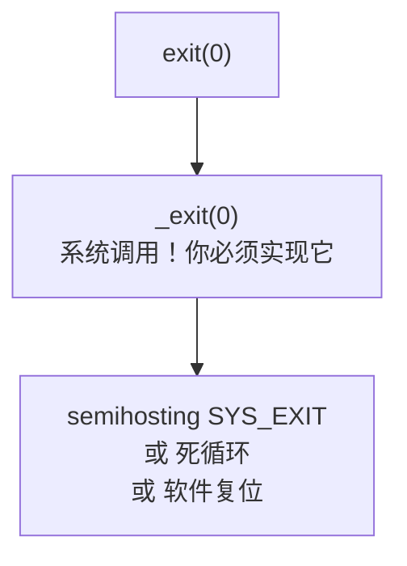
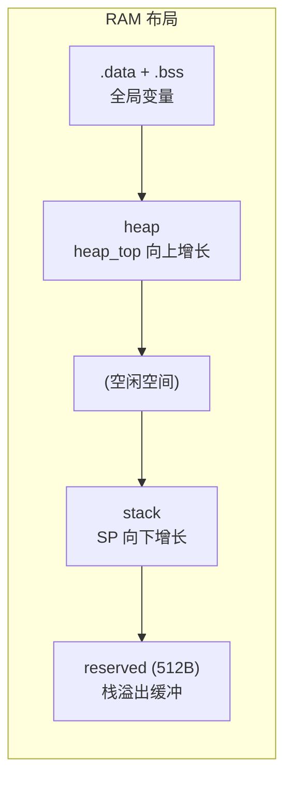

# newlib-nano 指南

## 什么是 newlib-nano？

**newlib-nano** 是 ARM GCC 工具链自带的精简版 C 标准库，专为微控制器设计。


---

## 如何启用 newlib-nano

### 链接时使用 specs 文件

```cmake
# CMakeLists.txt
target_link_options(${PROJECT_NAME} PRIVATE
    -specs=nano.specs    # 使用 newlib-nano
    -nostartfiles        # 使用自己的启动代码
)

target_link_libraries(${PROJECT_NAME} PRIVATE
    m                    # 数学库 libm
    gcc                  # GCC 运行时（软件除法等）
)
```

等价于：

```bash
arm-none-eabi-gcc -specs=nano.specs -nostartfiles main.o -lm -lgcc -o firmware.elf
```

### specs 文件对比

| specs 文件 | 库 | 大小 | 适用场景 |
|------------|-----|------|----------|
| `nosys.specs` | 完整 newlib | 大 | 开发阶段，需要完整功能 |
| `nano.specs` | newlib-nano | 小 | 生产阶段，Flash 有限 |
| `rdimon.specs` | newlib + semihosting | 中 | 调试，通过调试器做 I/O |

---

## 系统调用接口

newlib 的高层函数（如 `printf`, `malloc`, `fopen`）依赖一套底层系统调用。在嵌入式系统中，你**必须自己实现**这些调用。

### 必须实现的系统调用

| 函数 | 用途 | 谁调用它 |
|------|------|----------|
| `_sbrk` | 堆内存分配 | `malloc` / `free` |
| `_write` | 写数据到文件 | `printf` / `fprintf` |
| `_read` | 从文件读数据 | `scanf` / `fgets` |
| `_exit` | 程序退出 | `exit` / `abort` |
| `_close` | 关闭文件 | `fclose` |
| `_lseek` | 文件定位 | `fseek` |
| `_fstat` | 文件状态 | `fstat` |
| `_isatty` | 是否为终端 | `printf` 缓冲判断 |
| `_open` | 打开文件 | `fopen` |

### 最简实现（仅支持 printf + malloc）

```c
// _sbrk: 堆分配（malloc 依赖）
extern uint8_t __heap_start;
extern uint8_t __heap_end;
static uint8_t *heap_top = &__heap_start;

void *_sbrk(int incr) {
    uint8_t *prev = heap_top;
    if (heap_top + incr > &__heap_end) return (void *)-1;
    heap_top += incr;
    return prev;
}

// _write: 输出（printf 依赖）
int _write(int fd, const char *buf, int count) {
    if (fd == 1 || fd == 2) {
        for (int i = 0; i < count; i++) {
            // 通过 semihosting 或 UART 输出 buf[i]
        }
        return count;
    }
    return -1;
}

// _exit: 退出
void _exit(int status) {
    while (1) {}  // 嵌入式系统不能真正退出
}
```

---

## 调用链示例

### printf 的调用链

```mermaid
flowchart TD
    PRINTF["printf(\"Hello %d\", 42)"]
    VFPRINTF["vfprintf()<br>格式化字符串 -> \"Hello 42\""]
    WRITE["_write(1, \"Hello 42\", 8)<br>系统调用！你必须实现它"]
    OUTPUT["semihosting SYS_WRITE<br>或 UART TX"]
    PRINTF --> VFPRINTF --> WRITE --> OUTPUT
```

### malloc 的调用链


### exit 的调用链



---

## newlib-nano 的空间优化技巧

### 1. 浮点格式化默认关闭

`printf("%f", 1.5)` 不输出任何内容！因为 newlib-nano 默认禁用 `%f` 支持以节省 ~12KB Flash。

```cmake
# 启用 printf 浮点支持（增加 ~12KB）
target_link_options(... PRIVATE -u _printf_float)
```

### 2. 使用 iprintf 代替 printf

`iprintf` 不支持浮点，但代码更小，适合整数为主的嵌入式应用。

### 3. 避免使用 fopen/fread

文件操作需要完整的文件系统支持（`_open`, `_close`, `_lseek` 等），在裸机开发中很少使用。

### 4. 使用 --gc-sections 移除未使用代码

```cmake
target_link_options(... PRIVATE -Wl,--gc-sections)
```

### 5. 选择合适的 malloc 实现

newlib 提供多种 malloc 实现：

| 实现 | 特点 |
|------|------|
| `dlmalloc`（默认） | 通用，碎片少，代码较大 |
| 自定义 `_sbrk` | 可以自己管理堆（最简单） |

---

## 堆管理

### 内存布局



### 堆溢出检测

```c
void *_sbrk(int incr) {
    if (heap_top + incr > &__heap_end) {
        // 堆耗尽！记录错误，尝试恢复
        return (void *)-1;  // ENOMEM
    }
    // ...
}
```

### FreeRTOS 的堆

**注意**：当使用 FreeRTOS 时，FreeRTOS 有**自己的堆管理**（`heap_4.c` 中的 `pvPortMalloc`）。FreeRTOS 任务不应使用标准 `malloc`，而应使用 `pvPortMalloc`。

```
newlib malloc: 使用 linker script 中定义的 __heap_start -> __heap_end
FreeRTOS heap: 使用 FreeRTOSConfig.h 中定义的 configTOTAL_HEAP_SIZE
```

两者使用**不同的内存区域**，互不干扰。

---

## 常见问题

### Q: printf 没有输出？

1. 检查 `_write` 是否实现
2. 检查 stdout 缓冲：换行符 `\n` 会刷新缓冲，或以 `setvbuf(stdout, NULL, _IONBF, 0)` 禁用缓冲

### Q: malloc 返回 NULL？

1. 堆空间不足（检查 `configTOTAL_HEAP_SIZE` 或 `__heap_end`）
2. 堆碎片化（尝试使用 `heap_4` 代替简单链表）
3. 请求过大（microbit 只有 16KB RAM！）

### Q: 浮点运算结果错误？

M0 没有硬件 FPU。所有浮点运算是软件模拟的。确保使用 `-mfloat-abi=soft`（这是默认值）。

### Q: `undefined reference to __aeabi_uidiv`？

M0 无硬件除法。需要链接 `libgcc`：`-lgcc`。

---

## 延伸阅读

- [newlib Documentation](https://sourceware.org/newlib/)
- [ARM GCC nano.specs](https://gcc.gnu.org/onlinedocs/gcc/ARM-Options.html)
- [Semihosting Specification](https://developer.arm.com/documentation/100863/)
