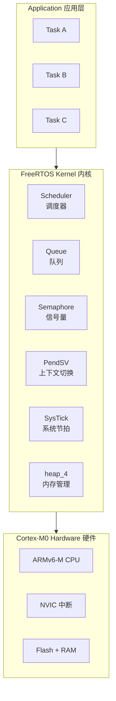
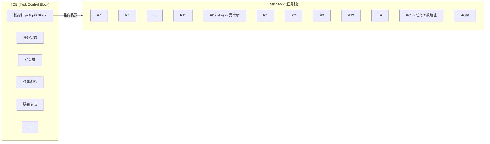
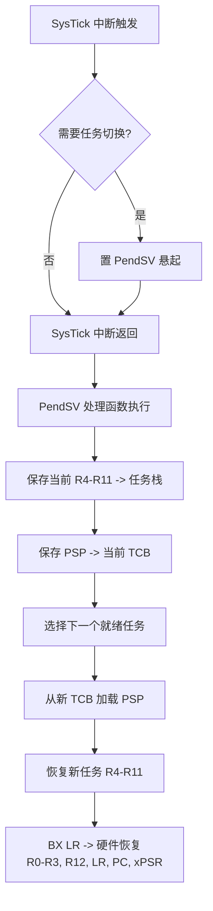
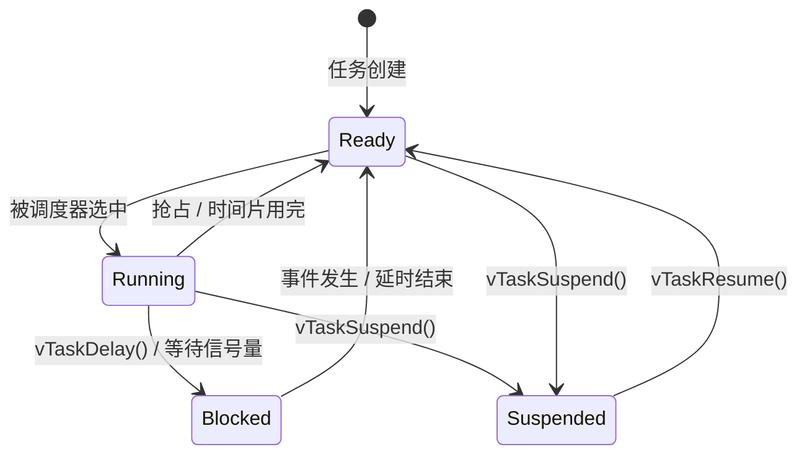
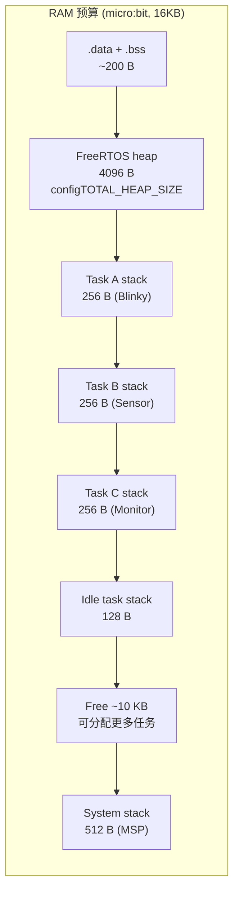

# FreeRTOS 指南

## 什么是 FreeRTOS？

**FreeRTOS** 是一个开源的实时操作系统（RTOS）内核，专为微控制器设计。



---

## 核心概念

### 任务（Task）

每个任务是一个独立的执行线程，有自己的栈空间和优先级。



### 调度器（Scheduler）

决定哪个任务在 CPU 上运行。

| 调度策略 | 说明 |
|----------|------|
| **抢占式** | 高优先级任务立即抢占低优先级任务 |
| **时间片** | 同优先级任务轮流运行（每个 tick 切换） |
| **协作式** | 任务主动让出 CPU |

**Cortex-M0 上下文切换流程：**



> **为什么用 PendSV？** PendSV 优先级设为最低，确保它在所有其他 ISR 完成后才执行。这样上下文切换不会抢占正在执行的 ISR。

---

## 任务状态转换



---

## FreeRTOSConfig.h 关键配置

```c
// 基础配置
#define configUSE_PREEMPTION          1   // 抢占式调度
#define configTICK_RATE_HZ            1000 // 1ms 节拍
#define configMAX_PRIORITIES          4   // 优先级数量
#define configMINIMAL_STACK_SIZE      60  // 最小任务栈（字）

// 内存
#define configTOTAL_HEAP_SIZE         (4096) // 堆大小（字节）
#define configUSE_MALLOC_FAILED_HOOK  1      // 分配失败钩子
#define configCHECK_FOR_STACK_OVERFLOW 1    // 栈溢出检测

// 可选功能（按需开启）
#define configUSE_MUTEXES             1   // 互斥锁
#define configUSE_COUNTING_SEMAPHORES 1   // 计数信号量
#define configUSE_TASK_NOTIFICATIONS  1   // 任务通知
#define configUSE_TIMERS              0   // 软件定时器（省 RAM）

// 硬件
#define configCPU_CLOCK_HZ            (16000000UL)
#define configENABLE_MPU             0   // M0 不使用 MPU
#define configTICK_TYPE_WIDTH_IN_BITS TICK_TYPE_WIDTH_32_BITS
```

---

## 内存预算示例（microbit, 16KB RAM）



---

## 关键 API 速查

### 任务管理

| API | 说明 |
|-----|------|
| `xTaskCreate(task, name, stack, param, prio, handle)` | 创建任务 |
| `vTaskDelay(ticks)` | 阻塞延时 |
| `vTaskDelayUntil(&last, ticks)` | 精确周期延时 |
| `vTaskSuspend(handle)` | 挂起任务 |
| `vTaskResume(handle)` | 恢复任务 |
| `vTaskDelete(handle)` | 删除任务 |
| `uxTaskGetStackHighWaterMark(handle)` | 剩余栈空间 |

### 队列

| API | 说明 |
|-----|------|
| `xQueueCreate(length, item_size)` | 创建队列 |
| `xQueueSend(queue, data, timeout)` | 发送（阻塞） |
| `xQueueReceive(queue, data, timeout)` | 接收（阻塞） |
| `xQueueSendFromISR(queue, data, pxHigherPriorityTaskWoken)` | ISR 中发送 |

### 信号量 / 互斥锁

| API | 说明 |
|-----|------|
| `xSemaphoreCreateBinary()` | 创建二值信号量 |
| `xSemaphoreCreateCounting(max, init)` | 创建计数信号量 |
| `xSemaphoreTake(sem, timeout)` | 获取信号量 |
| `xSemaphoreGive(sem)` | 释放信号量 |
| `xSemaphoreCreateMutex()` | 创建互斥锁（含优先级继承） |

---

## Cortex-M0 移植关键点

### port.c 核心函数

```c
// 启动第一个任务（通过 SVC 指令）
__asm void vPortSVCHandler(void) {
    // 从当前 TCB 加载 PSP
    // 恢复 R4-R11
    // BX LR -> 硬件恢复 R0-R3,R12,LR,PC,xPSR
}

// 上下文切换（PendSV handler）
__asm void xPortPendSVHandler(void) {
    // 保存 R4-R11 到当前任务栈
    // 切换到新任务
    // 恢复 R4-R11 从新任务栈
}

// 系统节拍
void xPortSysTickHandler(void) {
    // 递增 tick 计数器
    // 检查是否需要任务切换
}
```

### 临界区实现（M0 用 PRIMASK）

```c
// 进入临界区：关中断
void vPortEnterCritical(void) {
    __asm volatile("cpsid i");  // 屏蔽中断（除 NMI 和 HardFault）
}

// 退出临界区：恢复中断
void vPortExitCritical(void) {
    __asm volatile("cpsie i");  // 使能中断
}
```

---

## 常见问题

### Q: 任务不切换？

1. 检查 `configUSE_PREEMPTION = 1`
2. 检查 SysTick 是否正常工作
3. 检查任务是否在无限循环中（忘记 `vTaskDelay` 或 `taskYIELD`）

### Q: 栈溢出如何检测？

```c
#define configCHECK_FOR_STACK_OVERFLOW 2  // 严格模式
```

在创建任务时，FreeRTOS 用已知模式（0xA5）填充栈。当检测到模式被破坏时，调用 `vApplicationStackOverflowHook`。

### Q: 为什么不用标准 malloc？

FreeRTOS 有自己的堆管理（thread-safe），且更适合嵌入式：
- 确定性更强
- 支持多种分配策略（heap_1 ~ heap_5）
- 与临界区配合

### Q: 中断中能调用 FreeRTOS API 吗？

只有后缀为 `FromISR` 的函数可以在中断中调用，且中断优先级必须 ≤ `configMAX_SYSCALL_INTERRUPT_PRIORITY`。

---

## 延伸阅读

- [FreeRTOS Official Documentation](https://www.freertos.org/Documentation/RTOS_book.html)
- [FreeRTOS Kernel Source](https://github.com/FreeRTOS/FreeRTOS-Kernel)
- [ARM Cortex-M Exception Handling](https://developer.arm.com/documentation/dui0552/)
