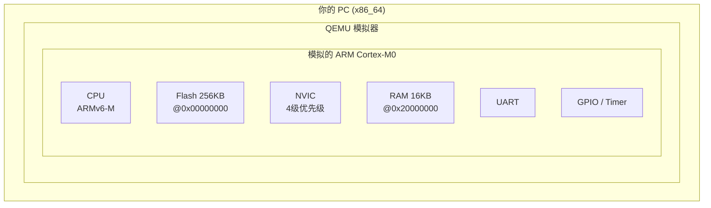
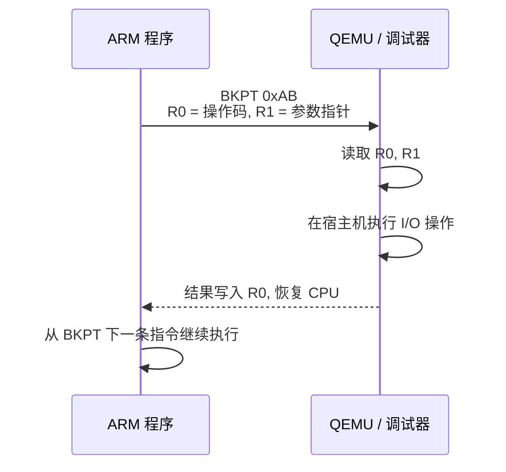
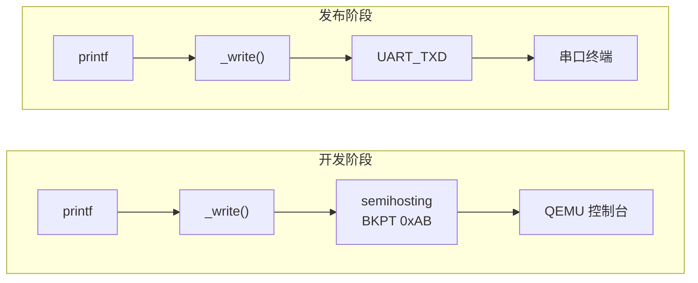
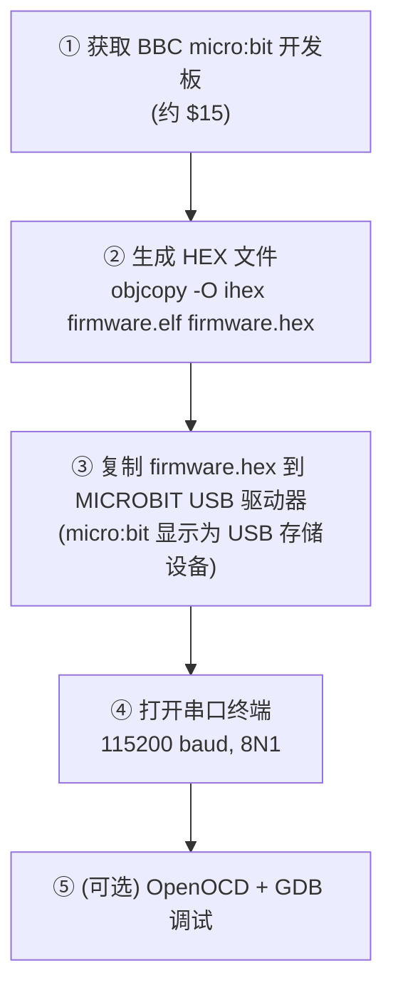

# QEMU ARM System Emulation Guide

## 什么是 QEMU？

**QEMU**（Quick EMUlator）是一个开源的机器模拟器。它可以模拟完整的 ARM Cortex-M 微控制器，在 PC 上运行嵌入式程序，**无需物理硬件**。



---

## 安装与版本

本项目使用：

```bash
qemu-system-arm.exe --version
# QEMU emulator version 11.0.0
```

路径：`C:\Program Files\qemu\qemu-system-arm.exe`

---

## 基本用法

```bash
qemu-system-arm \
    -M microbit \                        # 模拟 BBC micro:bit 开发板
    -kernel firmware.elf \               # 加载 ELF 文件
    -semihosting \                       # 启用 semihosting（核心调试功能）
    -nographic                           # 无图形界面，串口输出到终端
```

---

## QEMU vs 真实硬件

| 方面 | QEMU | 真实硬件 (nRF51822) |
|------|------|---------------------|
| **成本** | 免费 | 约 $15 (micro:bit 开发板) |
| **烧录** | 无需，直接加载 ELF | 需复制 .hex 到 USB 驱动器 |
| **调试** | GDB 远程连接 | 需要 SWD 调试器 (DAPLink) |
| **速度** | 取决于 PC 性能 | 16MHz 固定 |
| **外设** | 部分模拟（有限制） | 完整 |
| **时序** | 不精确（无实时保证） | 精确 |
| **中断** | microbit 模型有已知问题 | 完全正常 |

---

## 常用参数详解

### -M（机器选择）

```bash
qemu-system-arm -M help   # 列出所有支持的机器
```

| 机器 | CPU | RAM | Flash | 说明 |
|------|-----|-----|-------|------|
| `microbit` | Cortex-M0 | 16KB | 256KB | BBC micro:bit（**本项目使用**） |
| `mps2-an385` | Cortex-M3 | 64KB | 4MB | ARM MPS2 FPGA 开发板 |
| `mps2-an386` | Cortex-M4 | 64KB | 4MB | 同上，M4 带 DSP |
| `lm3s6965evb` | Cortex-M3 | 64KB | 256KB | Stellaris 评估板 |
| `netduino2` | Cortex-M3 | 64KB | 256KB | Netduino 2 |

### -cpu（CPU 选择）

```bash
qemu-system-arm -cpu help | grep cortex
# cortex-m0, cortex-m3, cortex-m4, cortex-m7, cortex-m33, cortex-m55...
```

### -nographic

禁用图形窗口，将所有 I/O 重定向到终端：

```bash
-nographic   # 串口输出到终端，Ctrl+A X 退出
```

### -serial（串口配置）

```bash
-serial stdio     # 串口 ↔ 终端（可输入输出）⭐ 默认
-serial null      # 串口 -> /dev/null（丢弃输出）
-serial pty       # 串口 -> 伪终端
-serial tcp:localhost:9999  # 串口 -> TCP 端口
```

### -s -S（GDB 调试）

```bash
-s   # 启动 GDB 服务器在 localhost:1234（等价于 -gdb tcp::1234）
-S   # 启动时暂停 CPU，等待 GDB 连接
```

### -d（调试输出）

```bash
-d guest_errors    # 打印模拟器检测到的错误（推荐调试外设用）
-d int             # 打印中断信息（调试中断问题）
-d cpu             # 打印 CPU 状态
-d in_asm          # 打印每条执行的指令（注意：会产生海量输出！）
```

---

## Semihosting 详解

### 什么是 Semihosting？

**Semihosting**（半主机）是 ARM 定义的一种调试机制。名字的含义：

- **Hosting**（主机）：在真实系统中，I/O 操作（printf、文件读写）由**主机操作系统**提供
- **Semi**（半）：在嵌入式裸机系统中没有 OS，但**调试器/模拟器可以充当"半个主机"**

简单来说：**程序通过一条特殊指令请求 QEMU（或调试器）帮它做 I/O**。



### 工作原理

1. 程序执行 `BKPT 0xAB` 指令（断点指令，操作数 0xAB 是 semihosting 的魔数）
2. CPU 触发调试事件
3. QEMU（作为调试器）拦截这个事件
4. QEMU 读取 R0（操作码）和 R1（参数指针）
5. QEMU 在宿主机上执行对应的操作（写控制台、读文件等）
6. QEMU 将返回结果写入 R0
7. QEMU 恢复 CPU，从 `BKPT` 的下一条指令继续执行

### 调用约定

```
输入:
  R0 = 操作码 (operation number)
  R1 = 参数块指针 (pointer to parameter block)

输出:
  R0 = 返回值 (0 = 成功，非 0 = 错误码)
```

### 所有 Semihosting 操作

以下为 ARM semihosting 规范定义的全部操作。嵌入式开发中最常用的是 **SYS_WRITE0**、**SYS_WRITEC** 和 **SYS_EXIT**。

| 操作码 | 名称 | 参数块 | 功能 | 常用度 |
|--------|------|--------|------|--------|
| 0x00 | SYS_OPEN | `[name_ptr, mode, name_len]` | 打开文件 |  |
| 0x01 | SYS_CLOSE | `[fd]` | 关闭文件 |  |
| 0x02 | SYS_WRITEC | `[char_ptr]` | 写一个字符到控制台 |   |
| 0x03 | SYS_WRITE0 | `string_ptr` | 写 NUL 结尾字符串到控制台 |   |
| 0x04 | SYS_WRITE | `[fd, buf_ptr, len]` | 写 N 字节到文件 |   |
| 0x05 | SYS_READ | `[fd, buf_ptr, len]` | 从文件读 N 字节 |   |
| 0x06 | SYS_READC | （无参数） | 从控制台读一个字符 |   |
| 0x07 | SYS_ISERROR | `[status]` | 检查返回码是否为错误 |  |
| 0x08 | SYS_ISTTY | `[fd]` | 检查是否为终端 |  |
| 0x09 | SYS_SEEK | `[fd, pos]` | 移动文件指针 |  |
| 0x0A | SYS_FLEN | `[fd]` | 获取文件长度 |  |
| 0x0B | SYS_TMPNAM | `[buf_ptr, id, size]` | 生成临时文件名 |  |
| 0x0C | SYS_REMOVE | `[name_ptr, name_len]` | 删除文件 |  |
| 0x0D | SYS_RENAME | `[old_ptr, old_len, new_ptr, new_len]` | 重命名文件 |  |
| 0x0E | SYS_CLOCK | （无参数） | 获取当前时间（厘秒） |  |
| 0x0F | SYS_TIME | `[time_ptr]` | 获取 Unix 时间戳 |  |
| 0x10 | SYS_SYSTEM | `[cmd_ptr, cmd_len]` | 执行宿主机命令 |  |
| 0x11 | SYS_ERRNO | （无参数） | 获取上次错误号 |  |
| 0x12 | SYS_GET_CMDLINE | `[buf_ptr, buf_len]` | 获取命令行参数 |  |
| 0x13 | SYS_HEAPINFO | `[heap_block]` | 获取堆信息 |  |
| 0x15 | SYS_EXIT | `[exit_code]` | 退出 QEMU |   |
| 0x16 | SYS_EXIT_EXTENDED | `[exit_code, sub_code]` | 扩展退出（带子码） |  |
| 0x17 | SYS_ELAPSED | `[time_low, time_high]` | 获取已运行时间 |  |

> 星标 = 嵌入式开发最常用

### 代码示例

#### 最简单的 Hello World（SYS_WRITE0）

```c
// SYS_WRITE0（0x04）：输出 NUL 结尾字符串
// 参数块 = 字符串指针本身（不是指向指针的指针！）
static void sh_puts(const char *str) {
    register int         r0 __asm__("r0") = 0x04;
    register const char *r1 __asm__("r1") = str;
    __asm__ volatile("bkpt #0xAB" : "+r"(r0) : "r"(r1) : "memory");
}

int main(void) {
    sh_puts("Hello from semihosting!\n");
    return 0;
}
```

#### 逐字符输出（SYS_WRITEC）

```c
// SYS_WRITEC（0x03）：输出单个字符
static void sh_putc(char c) {
    register int r0 __asm__("r0") = 0x03;
    register char *r1 __asm__("r1") = &c;
    __asm__ volatile("bkpt #0xAB" : "+r"(r0) : "r"(r1) : "memory");
}
```

#### 退出 QEMU（SYS_EXIT）

```c
// SYS_EXIT（0x18）：通知 QEMU 程序已退出
static void sh_exit(int code) {
    int param[2] = {code, 0};
    register int r0 __asm__("r0") = 0x18;
    register int *r1 __asm__("r1") = param;
    __asm__ volatile("bkpt #0xAB" : "+r"(r0) : "r"(r1) : "memory");
}
```

#### 汇编版本

```asm
@ SYS_WRITE0 — 输出 NUL 结尾字符串
@ 输入: R0 = 字符串地址
semihosting_write0:
    movs    r1, r0          @ R1 = 字符串指针
    movs    r0, #0x04       @ R0 = SYS_WRITE0
    bkpt    #0xAB           @ 触发 semihosting
    bx      lr              @ 返回
```

### Semihosting 的局限性

| 局限 | 说明 | 解决方案 |
|------|------|----------|
| **速度慢** | 每次 BKPT 都涉及 QEMU ↔ 宿主机交互 | 批量输出，减少调用次数 |
| **仅调试用** | 真实硬件上需要调试器连接 | 发布版用 UART 驱动替代 |
| **阻塞执行** | BKPT 期间程序暂停 | 不在 ISR 中大量使用 |
| **无缓冲** | 逐字符输出很慢 | 使用 SYS_WRITE0 一次输出整行 |
| **无格式化** | 只能输出字符串，没有 printf 功能 | 配合 snprintf 或 newlib-nano |

### Semihosting vs UART 驱动



在本项目中，Lesson 1-4 使用 semihosting，Lesson 5 学习 UART 驱动后可以切换到真实硬件。

---

## GDB 调试完整流程

### Terminal 1：启动 QEMU（等待调试器）

```bash
qemu-system-arm \
    -M microbit \
    -kernel firmware.elf \
    -semihosting \
    -nographic \
    -s -S              # ⬅ -s = GDB server, -S = 暂停等待
```

QEMU 启动后会**暂停**在复位向量处，等待 GDB 连接。

### Terminal 2：连接 GDB

```bash
arm-none-eabi-gdb firmware.elf -x scripts/debug.gdb
```

或者手动连接：

```
(gdb) target remote localhost:1234
(gdb) info registers
(gdb) x/10x 0x00000000        # 查看向量表
```

### GDB 常用命令速查

#### 执行控制

| 命令 | 快捷键 | 说明 |
|------|--------|------|
| `continue` | `c` | 继续执行直到断点 |
| `stepi` | `si` | 单步执行**一条指令**（进入函数） |
| `nexti` | `ni` | 单步执行一条指令（跳过函数） |
| `step` | `s` | 单步执行**一行 C 代码**（进入函数） |
| `next` | `n` | 单步执行一行 C 代码（跳过函数） |
| `finish` | `fin` | 执行到当前函数返回 |

#### 断点

| 命令 | 说明 |
|------|------|
| `break main` | 在 main 函数设软件断点 |
| `break startup.c:42` | 在 startup.c 第 42 行设断点 |
| `hbreak reset_handler` | 硬件断点（在 Flash 中调试用） |
| `info breakpoints` | 列出所有断点 |
| `delete 1` | 删除 1 号断点 |

#### 检查状态

| 命令 | 说明 |
|------|------|
| `info registers` | 查看所有 CPU 寄存器 |
| `info reg r0 r1 r2 lr pc` | 查看指定寄存器 |
| `print/x $sp` | 以 hex 格式显示 SP |
| `print/x $xpsr` | 显示程序状态寄存器 |
| `x/10x $sp` | 显示栈顶 10 个 32 位字 |
| `x/s 0x20000000` | 以字符串格式显示某地址 |
| `x/i $pc` | 显示当前指令 |
| `disas /m` | 反汇编（混合 C 源码） |
| `disas reset_handler` | 反汇编指定函数 |
| `backtrace` | 显示调用栈 |
| `info frame` | 显示当前栈帧详情 |

#### 数据操作

| 命令 | 说明 |
|------|------|
| `print variable` | 打印变量值 |
| `print/x variable` | 以 hex 打印变量 |
| `set variable x = 42` | 修改变量值 |
| `set $r0 = 0x42` | 修改寄存器值 |

#### QEMU 控制

| 命令 | 说明 |
|------|------|
| `monitor system_reset` | 复位 CPU |
| `monitor quit` | 退出 QEMU |

---

## QEMU 快捷键

在 `-nographic` 模式下：

| 快捷键 | 功能 |
|--------|------|
| `Ctrl+A` 然后 `X` | 退出 QEMU |
| `Ctrl+A` 然后 `C` | 进入 QEMU monitor（查看模拟器状态） |
| `Ctrl+A` 然后 `H` | 显示帮助 |
| `Ctrl+A` 然后 `S` | 保存虚拟机状态到磁盘 |
| `Ctrl+A` 然后 `T` | 显示模拟器时间信息 |

---

## QEMU microbit 已知限制

本项目在实践中发现 QEMU microbit 模型的以下限制（截至 QEMU v11.0.0）：

| 功能 | QEMU 状态 | 真实硬件 | 影响 |
|------|-----------|----------|------|
| CPU / 指令集 | 正确模拟 | — | 无影响 |
| Semihosting | 完全支持 | 需要调试器 | Lesson 1-4, 6, 8 可用 |
| SysTick 计数器 | 减计数正常 | 正常 | COUNTFLAG 轮询可用 |
| SysTick 中断 | **不触发** | 正常工作 | FreeRTOS 调度器无法运转 |
| PendSV 触发 | **导致 HardFault** | 正常工作 | 上下文切换无法演示 |
| UART TX | **TXDRDY 永不置位** | 正常工作 | UART 发送卡死 |
| UART RX | **无数据到达** | 正常工作 | 串口控制台无法交互 |
| GPIO 输出 | 寄存器可读写 | 正常工作 | 可以模拟 I/O 逻辑 |
| GPIO 输入 | 固定为 0 | 读取引脚电平 | 无法测试按钮 |
| Timer | 不确定 | 正常工作 | — |

>  **所有项目代码均针对真实 nRF51822 硬件编写。** QEMU 的限制不影响代码正确性，仅影响能否在模拟器中观察到完整行为。

### 如何在 QEMU 中测试 FreeRTOS？

由于 SysTick 中断不触发，有以下替代方案：

1. **使用 MPS2 开发板模型**（Cortex-M3）— SysTick 在 `mps2-an385` 上工作正常
2. **在真实 micro:bit 硬件上运行** — 全部功能正常
3. **阅读生成的 .disasm 文件** — 验证编译器输出正确性

---

## Semihosting 实现的新旧方式对比

### 旧方式（ARM SVC 方式，已废弃）

```
MOVS R0, #0x18       @ 操作码
SVC  0x123456        @ 触发 semihosting（通过 SVC 指令）
```

> M0 不支持此方式（这是 ARM 状态的编码）。

### 新方式（Thumb BKPT 方式，当前使用）

```
MOVS R0, #0x18       @ 操作码
BKPT 0xAB            @ 触发 semihosting（通过断点指令）
```

> 所有 ARMv6-M 及更高版本的 Cortex-M 都支持此方式。

---

## 运行脚本说明

本项目提供的辅助脚本位于 `scripts/` 目录：

### run_qemu.sh

```bash
# 正常运行
bash scripts/run_qemu.sh lesson_01_bare_metal/build/Debug/lesson_01_bare_metal.elf

# 调试模式（GDB 端口 1234, 启动时暂停）
bash scripts/run_qemu.sh lesson_01_bare_metal/build/Debug/lesson_01_bare_metal.elf --gdb-pause

# 禁用 semihosting
bash scripts/run_qemu.sh lesson_01_bare_metal/build/Debug/lesson_01_bare_metal.elf --no-semihosting
```

### build.sh

```bash
# 构建指定阶段
bash scripts/build.sh lesson_01_bare_metal Debug
bash scripts/build.sh lesson_01_bare_metal Release
```

---

## 从 QEMU 迁移到真实硬件



**代码无需修改**（项目中的 UART 驱动是针对 nRF51822 编写的）。

---

## 延伸阅读

- [QEMU ARM System Emulation](https://www.qemu.org/docs/master/system/arm/microbit.html)
- [ARM Semihosting Specification v3.0](https://developer.arm.com/documentation/100863/)
- [QEMU GDB Usage](https://www.qemu.org/docs/master/system/gdb.html)
- [nRF51822 Product Specification](https://infocenter.nordicsemi.com/pdf/nRF51822_PS_v3.3.pdf)
