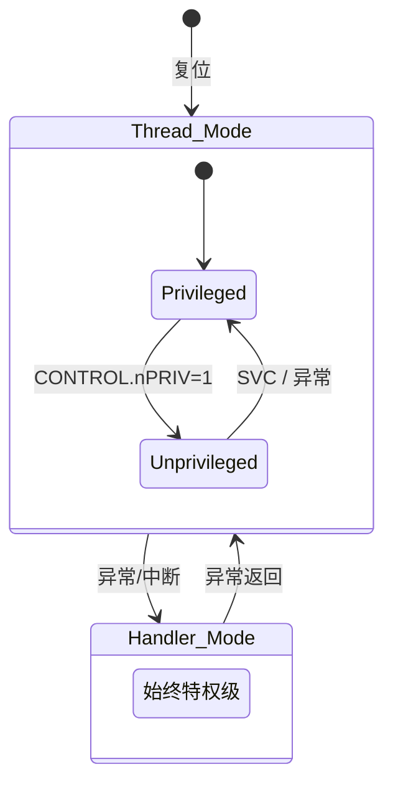

# Cortex-M0 Architecture Deep Dive

## 程序员模型

### 寄存器组

Cortex-M0 有 16 个 32 位通用寄存器（R0-R15）和若干特殊寄存器：

```
R0-R3   参数 / 返回值 / 临时寄存器（调用者保存）
R4-R7   通用寄存器（被调用者保存）
R8-R11  通用寄存器（被调用者保存）
R12     IP (Intra-Procedure-call scratch) — 调用者保存
R13/SP  栈指针（MSP / PSP 双 bank）
R14/LR  链接寄存器（BL 指令自动写入返回地址）
R15/PC  程序计数器（bit[0] = 1 表示 Thumb 状态）

xPSR    程序状态寄存器（APSR + IPSR + EPSR）
PRIMASK 全局中断屏蔽寄存器（1 = 屏蔽）
CONTROL 控制寄存器（nPRIV + SPSEL）
```

### 操作模式



M0 只有两种模式：**Thread** 和 **Handler**。M0 没有 M3/M4 的 Thread-unprivileged 到 Handler 的自动切换——它始终在特权级运行（除非手动设置 CONTROL.nPRIV）。

### 栈指针 Bank

| 模式 | 默认 SP | 可切换至 |
|------|---------|----------|
| Thread | MSP | PSP（设置 CONTROL.SPSEL=1） |
| Handler | MSP（固定） | 不可切换 |

> FreeRTOS 利用这个特性：任务使用 PSP，内核/ISR 使用 MSP。

---

## 内存映射

Cortex-M0 使用固定的 4GB 地址空间：

```
0x00000000 ─┬─ Code (Flash)
0x1FFFFFFF ─┘
0x20000000 ─┬─ SRAM (RAM)
0x3FFFFFFF ─┘
0x40000000 ─┬─ Peripherals (外设)
0x5FFFFFFF ─┘
0xE0000000 ─┬─ Private Peripheral Bus (SCS/NVIC/SysTick)
0xE00FFFFF ─┘
0xE0100000 ─┬─ Reserved (Vendor-specific)
0xFFFFFFFF ─┘
```

### microbit (nRF51822) 具体映射

| 区域 | 起始 | 结束 | 大小 | 用途 |
|------|------|------|------|------|
| Flash | 0x00000000 | 0x0003FFFF | 256KB | 代码 + 只读数据 |
| RAM | 0x20000000 | 0x20003FFF | 16KB | 数据 + 栈 + 堆 |
| FICR | 0x10000000 | 0x10000100 | 256B | 出厂配置（只读） |
| UICR | 0x10001000 | 0x10001080 | 128B | 用户配置 |
| POWER | 0x40000000 | | | 电源管理 |
| UART0 | 0x40002000 | | | 串口 |
| TWI/SPI | 0x40003000 | | | I2C / SPI |
| TIMER0 | 0x40008000 | | | 定时器 |
| WDT | 0x40010000 | | | 看门狗 |
| GPIO | 0x50000000 | | | GPIO |
| SCS/NVIC | 0xE000E000 | | | 系统控制 |

---

## 异常模型

### 异常编号

```
编号    名称       优先级         说明
-3      Reset      -3 (固定)      上电/复位
-2      NMI        -2 (固定)      不可屏蔽中断
-1      HardFault  -1 (固定)      所有故障
11      SVCall     可配置         超级用户调用 (FreeRTOS)
14      PendSV     可配置         可悬起系统调用 (RTOS 上下文切换)
15      SysTick    可配置         系统节拍定时器
16-47   IRQ0-31    可配置         外部中断
```

> M0 没有 MemManage/BusFault/UsageFault —— 所有故障都进 HardFault。

### 异常入口（硬件自动完成）

```
1. 压栈 8 个字（从高地址到低地址）：
   xPSR → PC → LR → R12 → R3 → R2 → R1 → R0

2. 从向量表加载异常处理函数地址 → PC

3. LR 设置为 EXC_RETURN 值：
   0xFFFFFFF9 = 返回 Thread 模式, 使用 MSP
   0xFFFFFFFD = 返回 Thread 模式, 使用 PSP  
   0xFFFFFFF1 = 返回 Handler 模式
```

### 异常退出

```asm
bx  lr        @ LR = EXC_RETURN, 硬件自动出栈 8 个寄存器
```

或者：
```asm
pop  {pc}     @ 从栈弹出 PC, 同时触发硬件出栈
```

### EXC_RETURN 值

| 值 | 返回模式 | 使用的 SP |
|----|----------|-----------|
| 0xFFFFFFF1 | Handler | MSP |
| 0xFFFFFFF9 | Thread | MSP |
| 0xFFFFFFFD | Thread | PSP |

---

## NVIC（嵌套向量中断控制器）

### 特性

- 最多 32 个外部中断 (IRQ0-IRQ31)
- 4 级优先级（M0 仅使用 2 位优先级）
- 支持中断嵌套（高优先级抢占低优先级）
- 支持尾链（tail-chaining）：连续处理多个中断时不重复压栈/出栈
- 支持迟到（late-arriving）：更高优先级中断在压栈期间到达可直接抢占

### 优先级

M0 仅实现优先级的高 2 位（4 级）：

| 优先级值 | 级别 | 典型用途 |
|----------|------|----------|
| 0x00 | 最高 | HardFault, NMI |
| 0x40 | 高 | 时间关键外设 |
| 0x80 | 中 | 普通外设 |
| 0xC0 | 最低 | PendSV (RTOS 上下文切换) |

### 关键寄存器

| 寄存器 | 地址 | 用途 |
|--------|------|------|
| ISER | 0xE000E100 | 中断使能设置 |
| ICER | 0xE000E180 | 中断使能清除 |
| ISPR | 0xE000E200 | 中断悬起设置 |
| ICPR | 0xE000E280 | 中断悬起清除 |
| IPR0-7 | 0xE000E400 | 中断优先级 (每字节一个 IRQ) |

---

## 系统控制块 (SCB)

SCB 位于系统控制空间 (SCS) 内，提供系统状态和控制功能。

| 寄存器 | 地址 | 用途 |
|--------|------|------|
| CPUID | 0xE000ED00 | CPU 识别（M0 = 0x410CC200） |
| ICSR | 0xE000ED04 | 中断控制与状态（PendSV/SysTick 控制） |
| AIRCR | 0xE000ED0C | 应用中断与复位控制（系统复位） |
| SCR | 0xE000ED10 | 系统控制（Sleep-on-Exit, SEVONPEND） |
| SHPR2 | 0xE000ED1C | 系统处理优先级 2 (SVCall) |
| SHPR3 | 0xE000ED20 | 系统处理优先级 3 (PendSV, SysTick) |

### ICSR (0xE000ED04) 关键位

| 位 | 名称 | 说明 |
|----|------|------|
| 28 | PENDSVSET | 写 1 悬起 PendSV |
| 27 | PENDSVCLR | 写 1 清除 PendSV 悬起 |
| 26 | PENDSTSET | 写 1 悬起 SysTick |
| 25 | PENDSTCLR | 写 1 清除 SysTick 悬起 |

### AIRCR (0xE000ED0C) — 系统复位

```c
// 写 VECTKEY + SYSRESETREQ 触发系统复位
*((volatile uint32_t *)0xE000ED0C) = 0x05FA0004;
```

---

## SysTick 定时器

Cortex-M 内建的 24 位递减定时器。

| 寄存器 | 地址 | 用途 |
|--------|------|------|
| CSR | 0xE000E010 | 控制与状态（ENABLE, TICKINT, CLKSOURCE, COUNTFLAG） |
| RVR | 0xE000E014 | 重载值（24 位） |
| CVR | 0xE000E018 | 当前值（写任意值清零） |
| CALIB | 0xE000E01C | 校准值（只读） |

### 配置示例

```c
// 1ms 中断 @ 16MHz
*SYST_RVR = 15999;      // 16000 - 1
*SYST_CVR = 0;           // 清零当前值
*SYST_CSR = 0x07;        // ENABLE | TICKINT | CLKSOURCE
```

---

## M0 限制速查

这些特性存在于 M3/M4，但 M0 没有：

| 缺失特性 | M3/M4 等价 | M0 替代方案 |
|----------|-----------|-------------|
| 硬件除法 | UDIV/SDIV | `__aeabi_uidiv` (libgcc) |
| 位域指令 | BFI/UBFX/SBFX | AND + LSL + LSR |
| 前导零计数 | CLZ | 循环 + TST |
| 字节序反转 | REV/REV16/RBIT | 软件实现 |
| 跳转表指令 | TBB/TBH | if-else 链 |
| 内存屏障 | DSB/ISB/DMB | 编译器屏障（3级流水线不需要） |
| MPU | 有 | 无 |
| VTOR | 有 | 无（向量表固定在 0x00000000） |
| MemManage/BusFault/UsageFault | 有 | 无（全部进 HardFault） |
| IT 块 (部分 GAS) | 有 | CMP + 分支 |
| CBZ/CBNZ (部分 GAS) | 有 | CMP + BEQ/BNE |
| WFE 事件接口 | TXEV/RXEV 引脚 | 仅内部事件 |

> 参见 [汇编指南](02_assembly.md) — "M0 没有的常用指令" 一节。

---

## 关键外设基地址速查 (nRF51822)

| 外设 | 基地址 | 课程 |
|------|--------|------|
| POWER | 0x40000000 | L10 (RESETREAS) |
| UART0 | 0x40002000 | L5 |
| TIMER0 | 0x40008000 | L5 |
| WDT | 0x40010000 | L10 |
| GPIO P0 | 0x50000000 | L5 |

---

## 相关课程

| 课程 | 本指南相关章节 |
|------|---------------|
| Lesson 1 | 内存映射, 启动流程 |
| Lesson 2 | 寄存器组, 指令集 |
| Lesson 4 | 异常模型, NVIC, SysTick, SCB |
| Lesson 7 | 异常入口/退出, PendSV, EXC_RETURN |
| Lesson 10 | WDT, RESETREAS, SCB (AIRCR 复位) |

## 外部参考

- [ARMv6-M Architecture Reference Manual](https://developer.arm.com/documentation/ddi0419/)
- [Cortex-M0 Technical Reference Manual](https://developer.arm.com/documentation/ddi0484/)
- [Cortex-M0 Devices Generic User Guide](https://developer.arm.com/documentation/dui0662/)
