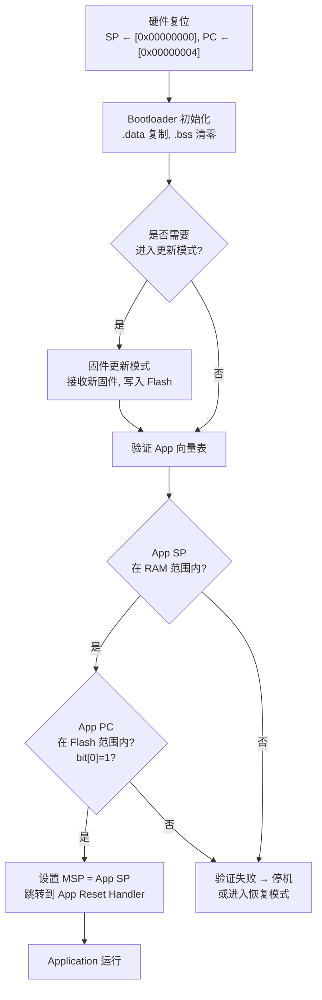
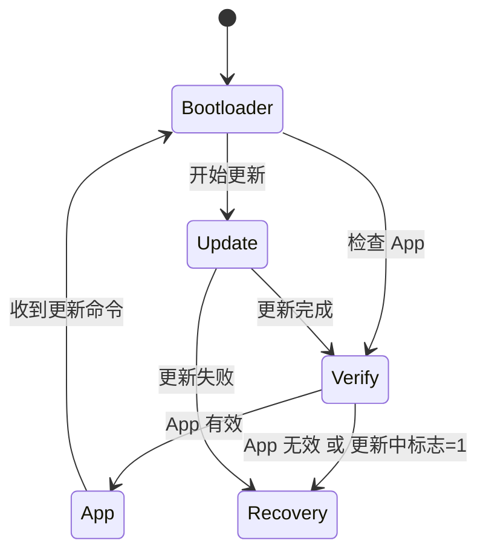

# Bootloader Design Guide

## 为什么需要 Bootloader？

在嵌入式系统中，Bootloader 是上电后执行的第一段代码，负责：

1. **固件更新** — 通过 USB/UART/无线下载新固件并写入 Flash
2. **安全启动** — 验证应用程序完整性后再跳转
3. **故障恢复** — 如果 App 损坏，Bootloader 保持在更新模式
4. **工厂编程** — 配合外部工具初始化空芯片

---

## Cortex-M0 的特殊限制：无 VTOR

### 什么是 VTOR？

VTOR（Vector Table Offset Register）控制向量表在内存中的位置。

- **Cortex-M0**: 没有 VTOR → 向量表固定在 `0x00000000`
- **Cortex-M0+/M3/M4/M7**: 有 VTOR → 可以把向量表放在任意位置

### M0 的后果

```
真实硬件:
  异常/中断 → 硬件读 0x00000000 的向量表 → 进入 handler
  
M0 的限制:
  App 的向量表在 0x00002000 → 硬件不会用它
  → 所有中断仍然走 Bootloader 的向量表
  → Bootloader 必须手动转发中断到 App
```

### 解决方案

| 方案 | 适用 | 说明 |
|------|------|------|
| **Bootloader 转发中断** | M0 | Bootloader 向量表中的每个 handler 检查 App 是否运行，如是则跳转到 App 对应的 handler |
| **VTOR 重映射（M0+以上）** | M0+/M3/M4 | 设置 `SCB->VTOR = APP_VECTOR_ADDR` |
| **仅 Bootloader 处理中断** | 简单系统 | App 不使用中断，所有中断由 Bootloader 处理 |

---

## Flash 分区

### 典型布局

```
+---------------------------+ 0x00000000
| Bootloader Vector Table   |
| Bootloader Code (.text)   |
| Bootloader Data (.rodata) |
+---------------------------+ 0x00002000 (8KB)
| Application Vector Table  |
| Application Code (.text)  |
| Application Data (.rodata)|
+---------------------------+
| ... free space ...        |
+---------------------------+ 0x00040000 (256KB)
```

### 为什么 Bootloader 放在开头？

- M0 硬件从 `0x00000000` 取复位向量
- Bootloader 必须在这里才能第一个执行
- 硬件中断也通过这里的向量表

---

## Bootloader → App 跳转流程



### 跳转代码

```c
typedef struct {
    uint32_t sp;  // 向量表[0] = 初始栈指针
    uint32_t pc;  // 向量表[1] = 复位处理函数
} app_vector_t;

void bootloader_jump_to_app(uint32_t app_addr) {
    const app_vector_t *app = (const app_vector_t *)app_addr;

    // 1. 验证 App 镜像
    if (app->sp < 0x20000000 || app->sp > 0x20004000) halt();
    if (app->pc < app_addr || app->pc > 0x00040000) halt();
    if ((app->pc & 1) == 0) halt();  // M0 必须 Thumb 状态

    // 2. 跳转
    uint32_t sp = app->sp;
    uint32_t pc = app->pc;
    __asm__ volatile (
        "msr MSP, %0\n"
        "bx  %1\n"
        : : "r"(sp), "r"(pc) : "memory"
    );
}
```

---

## 固件验证

### 为什么需要验证？

- 防止跳转到损坏的固件（Flash 位翻转、传输错误）
- 防止启动空 Flash（首次编程后）
- 在产品中：防止执行恶意代码

### 验证方法

| 方法 | 复杂度 | 安全性 | 适用场景 |
|------|--------|--------|----------|
| **Magic Number** | 低 | 低 | 简单的"是否存在"检测 |
| **CRC-32** | 中 | 中 | 检测传输/存储错误 |
| **SHA-256 Hash** | 高 | 高 | 安全关键系统 |
| **数字签名 (ECDSA/RSA)** | 最高 | 最高 | 防篡改、安全启动 |

### Magic Number 验证

最简单的方式——在 App 固件头部放一个魔数：

```c
// 在 App 的链接脚本中定义一个固定位置的魔数
// app_header_t 放在 App flash 的起始位置
typedef struct {
    uint32_t magic;      // 0xDEADBEEF 或自定义值
    uint32_t version;    // 固件版本号
    uint32_t size;       // 固件大小
    uint32_t crc;        // CRC-32 校验
} app_header_t;
```

### CRC-32 验证

```c
int verify_app(uint32_t app_addr) {
    const app_header_t *hdr = (const app_header_t *)app_addr;

    if (hdr->magic != APP_MAGIC) return 0;

    // 计算整个 App 固件的 CRC (不含 header 中的 crc 字段)
    uint32_t calc = crc32((const uint8_t *)app_addr + 16, hdr->size);
    return calc == hdr->crc;
}
```

---

## 故障安全更新 (Fail-Safe Update)

### 问题

如果在固件更新过程中断电，如何保证设备不会变砖？

### 方案 A: 双 Bank（需要更大 Flash）

```
Bank A (App v1.0)    ← 当前运行
Bank B (空)           ← 写入新固件
如果更新失败 → 继续从 Bank A 启动
如果更新成功 → 切换到 Bank B
```

### 方案 B: 恢复模式（单 Bank, Flash 较小）

```
+---------------------------+ 0x00000000
| Bootloader (只读, 不可更新)|
+---------------------------+ 0x00002000
| App 区域                   |
+---------------------------+

更新流程:
1. Bootloader 设置"更新中"标志
2. 擦除 App 区域, 写入新固件
3. 验证通过 → 清除"更新中"标志
4. 如果断电 → 重启后 Bootloader 看到"更新中"标志 → 进入恢复模式
```

### 状态机设计



---

## 实际开发建议

### 1. Bootloader 要尽量简单

- 不要使用动态内存分配
- 不要使用复杂的数据结构
- 代码审查要更严格（Bootloader 中的 bug = 设备变砖）

### 2. 保护 Bootloader 区域

- 链接脚本中只给 Bootloader 分配需要的 Flash 空间
- Bootloader 代码标记为只读
- 不提供擦除/写入 Bootloader 区域的接口

### 3. 充分测试升级场景

- 正常升级
- 升级中途断电
- 升级错误固件（CRC 错误）
- 空 Flash（首次烧录）
- 降级到旧版本

### 4. 版本兼容性

```c
typedef struct {
    uint32_t magic;         // 固定魔数
    uint16_t version_major; // 主版本（不兼容的变更）
    uint16_t version_minor; // 次版本（向后兼容的变更）
    uint32_t min_bootloader; // 要求的最低 Bootloader 版本
} version_info_t;
```

---

## 相关课程

| 课程 | 本指南相关章节 |
|------|---------------|
| Lesson 9 | Bootloader + App 双固件实现 |
| Lesson 11 | CRC 校验、故障日志 |
| Lesson 1 | 链接脚本、向量表 |

## 外部参考

- [MCUboot — 开源安全 Bootloader (Linux Foundation)](https://www.mcuboot.com/)
- [ARM Semihosting Specification](https://developer.arm.com/documentation/100863/)
- [nRF5 SDK Bootloader Documentation](https://infocenter.nordicsemi.com/)
