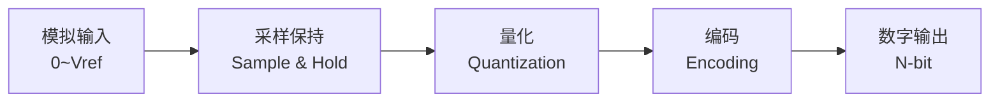

# ADC (Analog-to-Digital Converter) Guide

## 为什么嵌入式系统需要 ADC？

真实世界是**模拟**的——温度、光线、声音、压力——都是连续变化的物理量。CPU 只能处理**数字**信号（0 和 1）。ADC 是连接这两个世界的桥梁。

```
真实世界                        嵌入式系统
温度 ~25.3°C                    0x1A3 (10-bit ADC)
  │                                  ↑
  ├─ 传感器 ─→ 电压 0～3.3V ──→ ADC ──→ 数字量
```

---

## ADC 基本原理

### 采样-保持-量化



1. **采样**: 在某个瞬间捕捉模拟电压值
2. **保持**: 在转换期间保持电压稳定（用电容）
3. **量化**: 将电压映射到离散的数字值
4. **编码**: 将量化结果转为二进制

### 分辨率

```
N 位 ADC 的分辨率 = Vref / 2^N

8-bit  ADC @ 3.3V  →  12.9 mV / LSB
10-bit ADC @ 3.3V  →  3.2 mV / LSB
12-bit ADC @ 3.3V  →  0.8 mV / LSB
```

### 采样定理 (Nyquist-Shannon)

```
采样率 ≥ 2 × 信号最高频率

如果信号最高频率 = 1kHz
则采样率最低需要 2kHz (实际工程通常用 5-10 倍)
```

---

## nRF51822 ADC 外设

### 特性

| 特性 | nRF51 ADC |
|------|-----------|
| 分辨率 | 8/9/10 位 (可配置) |
| 通道数 | 8 路 (AIN0-AIN7) |
| 参考电压 | 内部 1.2V / VDD / 外部 AREF |
| 输入模式 | 单端 / 差分 |
| 触发方式 | 软件触发 (TASK_START) |
| 采样率 | 最高 200 ksps (10-bit) |
| 基地址 | 0x40007000 |

### 寄存器结构

```
ADC @ 0x40007000

TASKS_START   0x000   写 1 开始转换
TASKS_STOP    0x004   写 1 停止转换
EVENTS_END    0x104   转换完成事件
INTEN         0x300   中断使能
INTENSET      0x304   中断使能设置
INTENCLR      0x308   中断使能清除
ENABLE        0x500   使能 ADC
CONFIG        0x504   配置 (分辨率/输入/参考电压)
RESULT        0x508   转换结果 (只读)
```

### CONFIG 寄存器配置

```
bit 0:     RES (分辨率选择)
              0 = 8-bit
              1 = 9-bit
              2 = 10-bit
bit 2-4:   INPSEL (输入选择)
              0 = 不连接
              1 = AIN0 ... 8 = AIN7
bit 8-10:  REFSEL (参考电压)
              0 = 内部 1.2V (bandgap)
              1 = VDD (3.3V)
bit 16-18: PSEL (预分频电阻)
bit 20-22: EXTREFSEL (外部参考)
```

---

## ADC 采样模式

### 单次采样 (One-shot)

```c
// 最简单的用法: 手动触发一次转换
uint32_t adc_read_single(uint8_t channel) {
    // 配置: 10-bit, AINx, VDD_3V3 参考
    ADC->CONFIG = (2 << 0) | (channel << 2) | (1 << 8);
    ADC->ENABLE = 1;

    // 触发转换
    ADC->TASKS_START = 1;

    // 等待完成
    while (ADC->EVENTS_END == 0) {}

    uint32_t result = ADC->RESULT;

    ADC->EVENTS_END = 0;  // 清除事件
    ADC->ENABLE = 0;

    return result;
}

// 转为毫伏
uint32_t millivolts = (result * 3300) / 1024;  // 10-bit @ 3.3V
```

### 连续采样 (Continuous)

```c
// 使用 Timer + PPI 自动触发
// Timer 每隔 N 个周期触发一次 ADC TASK_START
// 结果通过 DMA (如果有) 或中断读取
```

---

## 提高 ADC 精度

### 硬件层面

| 技术 | 效果 |
|------|------|
| 独立 Vref 电源 | 减少电源噪声 |
| 模拟前端缓冲 | 高输入阻抗, 驱动 ADC 输入 |
| 低通滤波 (RC) | 抗混叠 |
| 差分输入 | 抑制共模噪声 |
| PCB 布局 | 模拟地与数字地分离 |

### 软件层面

| 技术 | 效果 | 代价 |
|------|------|------|
| **过采样 + 平均** | 每 4× 过采样 ≈ +1-bit 有效分辨率 | 消耗更多 CPU 时间 |
| **中值滤波** | 去除脉冲噪声 | 需要排序 |
| **移动平均** | 平滑输出 | 有延迟 |
| **校准** | 消除偏移和增益误差 | 需要已知参考 |

### 过采样示例

```c
// 过采样 16 次 → 有效分辨率 +2 bits
uint32_t adc_oversample(uint8_t channel, uint32_t samples) {
    uint32_t sum = 0;
    for (uint32_t i = 0; i < samples; i++) {
        sum += adc_read_single(channel);
    }
    return sum / samples;
}
```

### 常见噪声源

| 噪声源 | 表现 | 解决 |
|--------|------|------|
| 电源纹波 | 读数随电源波动 | 加去耦电容, 使用内部 bandgap 参考 |
| 数字地噪声 | MCU 引脚切换时读数跳动 | 分离模拟/数字地, 模拟采样期间暂停数字 I/O |
| 热噪声 | 随机小幅跳动 | 过采样 + 平均 |
| 50/60Hz 工频 | 正弦波干扰 | 采样周期设为 20ms/16.7ms 的整数倍 |

---

## 实际应用场景

### 场景 1: 温度传感器 (NTC 热敏电阻)

```
VCC ──┬── NTC ──┬── ADC
       │          │
       Rp        GND

NTC 电阻随温度变化 → 分压变化 → ADC 读数变化 → 查表得温度
```

### 场景 2: 电池电压监测

```
BAT ── R1 ──┬── R2 ── GND
              │
             ADC (分压后)
             
4.2V 电池 → 分压 1/3 = 1.4V → ADC 读数 → 计算实际电压
```

### 场景 3: 光线传感器 (LDR/光敏电阻)

```
VCC ── LDR ──┬── Rp ── GND
               │
              ADC

光照越强 → LDR 电阻越小 → ADC 读数越高
```

---

## 相关课程

| 课程 | 内容 |
|------|------|
| Lesson 5 | 外设寄存器访问 (内存映射 I/O) |
| Lesson 12 | 环形缓冲区 (ADC DMA 缓冲) |
| Lesson 13 | 中断优先级 (ADC 完成中断 vs 其他) |

## 外部参考

- [nRF51822 Product Specification — ADC chapter](https://infocenter.nordicsemi.com/pdf/nRF51822_PS_v3.3.pdf)
- [ADC Basics (TI Application Note)](https://www.ti.com/lit/an/sbaa331a/sbaa331a.pdf)
- [Oversampling Techniques (Atmel/Microchip)](https://www.microchip.com/en-us/application-notes/an8003)
