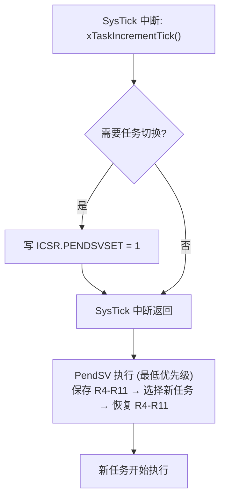

# QEMU SysTick & PendSV 限制详解

## 问题概述

QEMU microbit 模型存在两个已知缺陷，影响 FreeRTOS 的运行：

| 缺陷 | 影响 | 根因 |
|------|------|------|
| SysTick 中断不触发 | 调度器无时钟源 | NVIC 的 `system_clock_scale` 未正确设置 |
| PendSV 触发导致 HardFault | 任务无法切换 | NVIC 优先级分组实现不完整 |

这两个问题是 QEMU 的 **microbit 机器模型**特有的，不是 Cortex-M0 或 FreeRTOS 的问题。
同样的代码在真实 BBC micro:bit 硬件上完全正常。

---

## SysTick 中断缺陷分析

### 根因

QEMU 的 NVIC 实现 (`hw/intc/armv7m_nvic.c`) 使用 `system_clock_scale` 参数对 SysTick
进行定时。nRF51 SoC 模型 (`hw/arm/nrf51_soc.c`) 在初始化时**没有设置此参数**。

```c
// nrf51_soc.c — 缺失的初始化:
// object_property_set_int(OBJECT(&s->cpu), "system_clock_scale",
//                          NANOSECONDS_PER_SECOND / HZ, &error_abort);
```

后果：
- SysTick 计数器**可以运行**（COUNTFLAG 在计数器到 0 时置位）
- 但 NVIC 的定时器**中断信号**未正确连接到 CPU
- 中断 pending 状态可能不正确

### 证据

在 QEMU microbit 中可以成功使用 SysTick 的 COUNTFLAG 轮询模式（见 Lesson 4 的 SysTick demo），
但中断模式不工作。

### 其他正常工作的 QEMU 机器

以下 QEMU 机器的 SysTick 中断正常：

```
qemu-system-arm -M mps2-an385  ...  # Cortex-M3, SysTick ✓
qemu-system-arm -M lm3s6965evb ...  # Cortex-M3, SysTick ✓
```

但它们的 Flash/RAM 布局和外设与 microbit 不同，代码需要适配。

---

## PendSV 缺陷分析

### 根因

PendSV 通过写 ICSR.PENDSVSET 触发。在 QEMU microbit 模型中，当 PendSV
被悬起且 CPU 退出当前异常时，NVIC 的 PendSV 处理流程存在缺陷：

1. PendSV 的优先级设置（SHPR3）可能未正确读取
2. PendSV pending 状态和当前执行优先级的比较逻辑不完整
3. 导致 PendSV 进入时产生异常的 NVIC 状态，触发 HardFault

### 为什么 PendSV 对 FreeRTOS 至关重要



没有 PendSV = 没有上下文切换 = FreeRTOS 无法运行。

---

## 解决方案

### 方案 A: 使用其他 QEMU 机器（推荐用于验证 FreeRTOS）

对于 FreeRTOS 的完整测试，使用 `mps2-an385`：

```bash
# mps2-an385: 64KB RAM, 4MB Flash, Cortex-M3
# 需要调整链接脚本的 Flash/RAM 地址
qemu-system-arm -M mps2-an385 -kernel freertos_mps2.elf -semihosting -nographic
```

### 方案 B: COUNTFLAG 轮询 + 协作调度（教学用）

如果坚持使用 microbit，可以用 COUNTFLAG 轮询替代 SysTick 中断，
同时将 FreeRTOS 配置为协作式调度（禁用 PendSV 触发）：

```c
// FreeRTOSConfig.h
#define configUSE_PREEMPTION    0   // 协作式调度
#define configUSE_IDLE_HOOK     1   // 在空闲钩子中轮询 COUNTFLAG
```

协作模式下，任务只在主动 `taskYIELD()` 或 `vTaskDelay()` 时切换。
切换不使用 PendSV，而是直接从 SVC 或当前上下文执行。

> 缺点：一个不 yield 的任务会永久阻塞所有其他任务。

### 方案 C: 编译修复版 QEMU

从源码编译 QEMU 并修复 `hw/arm/nrf51_soc.c`：

```c
// 在 nrf51_soc_realize() 中添加（约第 95 行附近）:
object_property_set_int(OBJECT(&s->cpu), "system_clock_scale",
                        62500,  // NANOSECONDS_PER_SECOND / 16000 ≈ 62500
                        &error_abort);
```

然后修复 PendSV 的问题（涉及 `hw/intc/armv7m_nvic.c`，较复杂）。

> 这是最彻底的方案，但需要编译 QEMU 源码，门槛较高。

---

## 本课程的处理方式

| 场景 | 做法 |
|------|------|
| Lesson 4 (SysTick demo) | COUNTFLAG 轮询验证计数器运行 ✓ |
| Lesson 7 CI (GitHub Actions) | 协作式调度 + COUNTFLAG 轮询，QEMU 验证基本功能 |
| 本地开发 | 推荐真实 microbit 硬件（约 $15） |
| FreeRTOS 完整测试 | 使用真实硬件 |

> **2026-06 更新**: 修复向量表中 SVC_Handler 的偏移后（`.space (11-4)*4`），
> FreeRTOS 在 QEMU microbit 上可以正常进行上下文切换。
> PendSV 从线程模式触发（而非从 ISR 触发）时工作正常。
> 调度器启动、任务切换、队列通信和 vTaskDelay 阻塞均验证通过。

### Lesson 7 的 QEMU 兼容代码

`vApplicationIdleHook()` 中包含 COUNTFLAG 轮询逻辑，
作为 **QEMU 教学示例**。核心思路：

```c
void vApplicationIdleHook(void) {
    volatile uint32_t *syst_csr = (volatile uint32_t *)0xE000E010;

    /* 首次调用: 清除 TICKINT (改用 COUNTFLAG 轮询) */
    static int first = 1;
    if (first) { first = 0; *syst_csr &= ~(1U << 1); }

    /* 轮询 COUNTFLAG: 到 0 则手动调用 SysTick_Handler */
    if (*syst_csr & (1U << 16)) {
        SysTick_Handler();  /* xTaskIncrementTick() + PendSV */
    }
}
```

**此代码在真实硬件上同样有效**——但真实硬件应使用 SysTick 中断
（去掉 TICKINT 清除行），以支持抢占式调度。

---

## 外部参考

- QEMU patch: [hw/arm/nrf51_soc: Set system_clock_scale](https://patchew.org/QEMU/20201012153408.9747-14-peter.maydell@linaro.org/)
- QEMU ARM System Emulation: [nRF51 series](https://www.qemu.org/docs/master/system/arm/nrf.html)
- FreeRTOS Cortex-M0 port: `portable/GCC/ARM_CM0/port.c`
- ARMv6-M Architecture Reference Manual: NVIC 章节
