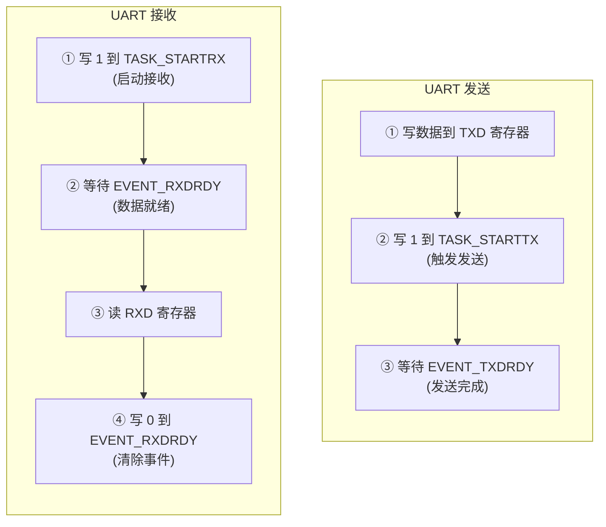

# Lesson 5: Peripherals & Hardware Programming

## 学习目标

- 理解内存映射 I/O（Memory-Mapped I/O）的工作原理
- 掌握 nRF51822（microbit）的外设寄存器访问
- 编写 UART、GPIO、Timer 设备驱动
- 使用 nRF51 的 task/event 模型
- 实现简易交互式串口控制台

## 文件结构

```
lesson_05_peripherals/
├── CMakeLists.txt
├── linker/microbit.ld
├── inc/
│   └── nrf51_registers.h     # nRF51822 外设寄存器定义
└── src/
    ├── startup.S
    ├── main.c
    ├── semihosting.c / .h
    ├── uart_driver.c / .h    # UART 驱动（task/event 模型）
    ├── gpio_driver.c / .h    # GPIO 驱动
    ├── timer_driver.c / .h   # TIMER0 驱动
    └── console.c / .h        # 交互式控制台
```

## 驱动模块

| 模块 | 寄存器基址 | 关键特性 |
|------|-----------|----------|
| UART0 | 0x40002000 | task/event 模型, 1200-1M baud |
| GPIO P0 | 0x50000000 | OUTSET/OUTCLR 原子位操作, PIN_CNF 配置 |
| TIMER0 | 0x40008000 | 16/24/32-bit 定时器, 4 通道 capture/compare |

## 关键知识点

### nRF51 task/event 模型



### GPIO 原子位操作

```c
// 不需要 read-modify-write！这些是原子操作：
GPIO_BASE->OUTSET = (1U << pin);  // 引脚输出高
GPIO_BASE->OUTCLR = (1U << pin);  // 引脚输出低
GPIO_BASE->DIRSET = (1U << pin);  // 设为输出
GPIO_BASE->DIRCLR = (1U << pin);  // 设为输入
```

### 定时器预分频器

| PRESCALER | 分频系数 | f_TIMER | 每 tick |
|-----------|----------|---------|---------|
| 0 | 1 | 16 MHz | 62.5 ns |
| 4 | 16 | 1 MHz | 1 us |
| 6 | 64 | 250 kHz | 4 us |
| 9 | 512 | 31.25 kHz | 32 us |

### QEMU 限制

- UART TX 卡死（TXDRDY 事件不触发）
- 寄存器映射和驱动代码对真实硬件正确
- 本阶段在 QEMU 中使用 semihosting 输出，保留真实硬件的 UART 驱动代码

## 相关文档

- [链接脚本指南](../docs/03_linker_script.md)（内存映射 I/O）
- [QEMU 指南](../docs/06_qemu.md)
