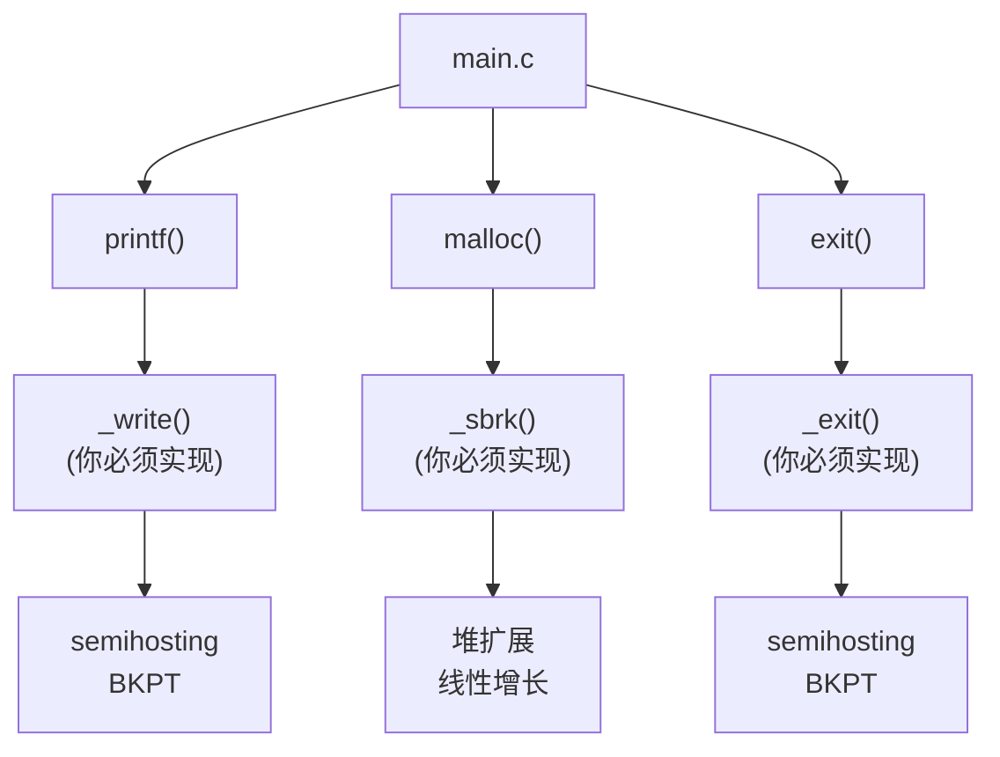
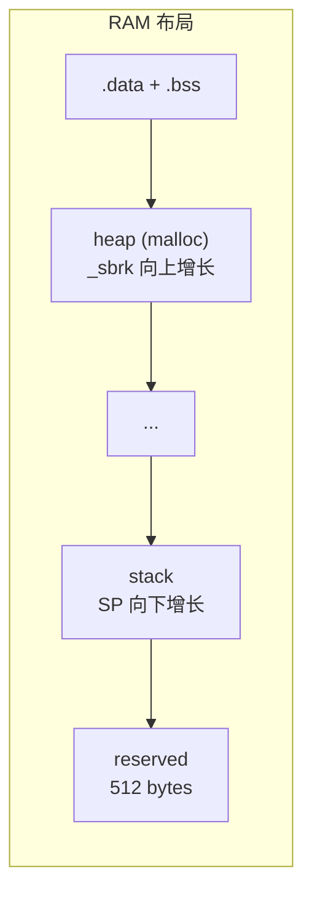

# Lesson 6: C Standard Library Integration (newlib-nano)

## 学习目标

- 理解 C 运行时系统调用接口（syscalls）
- 掌握堆管理（`_sbrk`）和 `malloc`/`free` 的使用
- 使用 `printf`/`snprintf` 等标准 I/O
- 在 M0 无 FPU 环境下使用数学函数
- 了解 newlib-nano 的配置与空间优化

## 文件结构

```
lesson_06_newlib/
├── CMakeLists.txt
├── linker/microbit.ld          # 含 __heap_start / __heap_end
└── src/
    ├── startup.S
    ├── main.c                  # 演示 printf, malloc, math, string
    ├── syscalls.c              # _sbrk, _write, _read, _exit 等实现
    ├── semihosting.c / .h
```

## 构建与运行

```bash
cmake -B build/Debug -S . -DCMAKE_TOOLCHAIN_FILE=../cmake/arm-none-eabi-gcc.cmake
cmake --build build/Debug

qemu-system-arm -M microbit -kernel build/Debug/lesson_06_newlib.elf \
    -semihosting -nographic
```

## 演示内容

| 演示 | 内容 | 依赖的 syscall |
|------|------|---------------|
| printf | 格式化输出整数、hex、字符串、指针 | `_write` |
| malloc | 动态内存分配与释放 | `_sbrk` |
| math | sin, cos, sqrt, pow, log（软件浮点） | —（libm） |
| string | strtol, qsort, bsearch | —（libc） |

## 关键知识点

### 系统调用实现



### 空间优化技巧

| 技巧 | 节省空间 |
|------|----------|
| 默认禁用 `printf("%f")` | ~12KB |
| 使用 `iprintf`（无浮点） | ~3KB |
| `--gc-sections` 移除未用代码 | 10-30% |
| `-Os` 优化 | 30-50% vs -O0 |

### 堆内存布局



### newlib-nano 浮点限制

`printf("%f", 1.5)` 默认不输出内容！因为 `%f` 支持被裁剪以节省空间。启用方法：

```cmake
target_link_options(... PRIVATE -u _printf_float)
```

但这会增加约 12KB Flash 使用量。在 M0 上推荐使用定点数代替浮点。

## 相关文档

- [newlib-nano 指南](../docs/04_newlib_nano.md)
- [ELF 格式指南](../docs/01_elf_format.md)（section 与内存布局）
- [GNU 工具链指南](../docs/00_toolchain.md)
