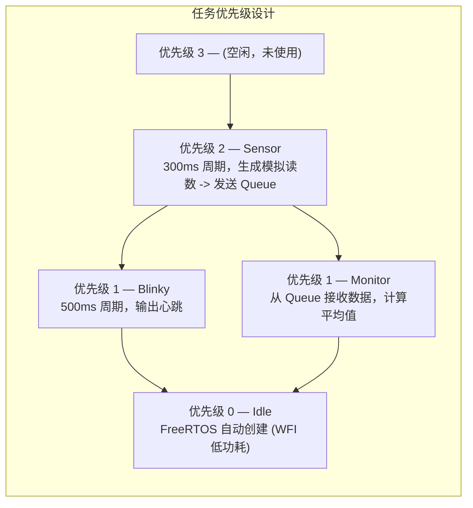
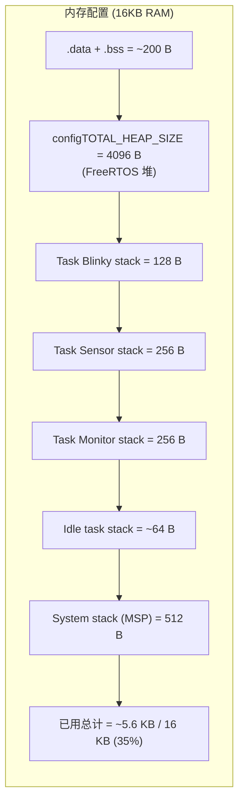
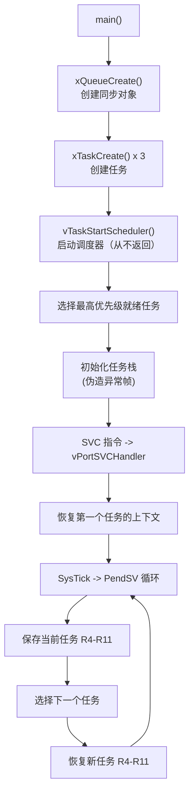
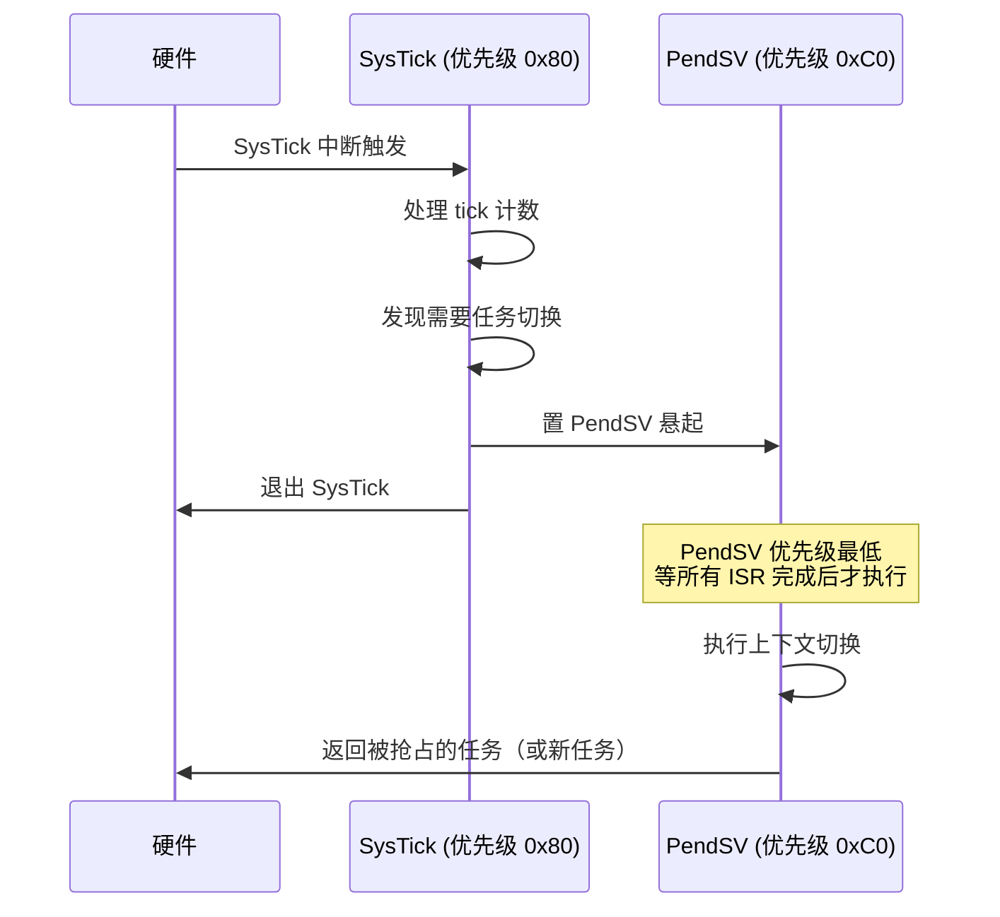

# Lesson 7: FreeRTOS on Cortex-M0

## 学习目标

- 理解 FreeRTOS 内核架构（任务、调度器、队列）
- 掌握 Cortex-M0 上 FreeRTOS 的移植（SVC、PendSV、SysTick）
- 创建多任务应用（Blinky、Sensor、Monitor）
- 使用 Queue 进行任务间通信
- 配置 FreeRTOSConfig.h 以适应 16KB RAM 约束

## 文件结构

```
lesson_07_freertos/
├── CMakeLists.txt
├── FreeRTOS-Kernel/                      # FreeRTOS V11.1.0 内核源码（git clone）
│   ├── tasks.c, queue.c, list.c, ...
│   └── portable/GCC/ARM_CM0/            # Cortex-M0 移植层
│       ├── port.c                        # 上下文切换、临界区
│       ├── portasm.c                     # SVC/PendSV 汇编处理函数
│       └── portmacro.h                   # 架构宏定义
├── inc/
│   └── FreeRTOSConfig.h                 # 内核配置
├── linker/microbit.ld
└── src/
    ├── startup.S                         # 向量表 → FreeRTOS 处理函数
    ├── main.c                            # 创建任务和队列
    ├── syscalls.c                        # memcpy/memset（FreeRTOS 依赖）
    ├── semihosting.c / .h
    ├── task_blinky.c                     # 心跳任务（演示 vTaskDelay）
    ├── task_sensor.c                     # 传感器任务（演示 xQueueSend）
    └── task_monitor.c                    # 监控任务（演示 xQueueReceive）
```

## 构建与运行

```bash
# FreeRTOS 内核作为 git submodule 管理
# 克隆项目时使用 --recurse-submodules 自动获取：
#   git clone --recurse-submodules https://github.com/neluca/embedded-from-scratch.git
# 如果已克隆但缺少子模块：
#   git submodule update --init --recursive

# 构建
cmake -B build/Debug -S . -DCMAKE_TOOLCHAIN_FILE=../cmake/arm-none-eabi-gcc.cmake
cmake --build build/Debug

# 运行（注意：QEMU microbit 不触发 SysTick 中断，调度器不工作）
qemu-system-arm -M microbit -kernel build/Debug/lesson_07_freertos.elf \
    -semihosting -nographic
```

## 任务设计



## 内存配置（16KB RAM）



## 关键知识点

### FreeRTOS 启动流程



### 上下文切换（PendSV）汇编伪代码

```asm
PendSV_Handler:
    cpsid   i                    @ 关中断
    mrs     r0, psp              @ 获取当前任务栈指针
    stmdb   r0!, {r4-r11}        @ 保存 R4-R11 到任务栈
    str     r0, [r1]             @ 更新 TCB 中的栈指针

    @ 选择下一个任务...

    ldr     r1, =pxCurrentTCB    @ 获取新 TCB
    ldr     r0, [r1]             @ 读取新任务栈指针
    ldmia   r0!, {r4-r11}        @ 恢复 R4-R11
    msr     psp, r0              @ 更新 PSP
    cpsie   i                    @ 开中断
    bx      lr                   @ 异常返回
```

### 为什么 PendSV 优先级最低？



> 如果直接在高优先级的 SysTick 中做上下文切换，会延迟其他同等优先级的中断。

### QEMU 限制与解决方案

QEMU microbit 模型有两个已知缺陷影响 FreeRTOS 运行：

| 缺陷 | 影响 | 状态 |
|------|------|------|
| SysTick 中断不触发 | 调度器无时钟源 | COUNTFLAG 轮询可替代 (见 idle hook) |
| PendSV 触发 HardFault | 任务无法切换 | 协作式调度可规避 (`configUSE_PREEMPTION=0`) |

**本课程在 `vApplicationIdleHook()` 中实现了 COUNTFLAG 轮询**
作为教学示例，展示如何在 QEMU 限制下理解 FreeRTOS tick 机制。

详细分析见 [QEMU 限制详解](../docs/11_qemu_limitations.md)。

> 在真实 BBC micro:bit 硬件上，SysTick 和 PendSV 完全正常。
> 代码无需修改即可在真实硬件上运行抢占式 FreeRTOS。

## 相关文档

- [FreeRTOS 指南](../docs/05_freertos.md)
- [ARM Cortex-M0 汇编指南](../docs/02_assembly.md)（PendSV 上下文切换）
