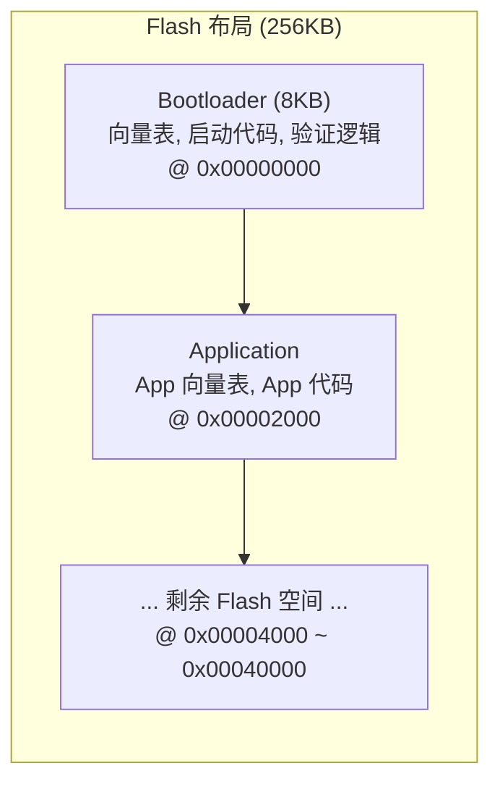
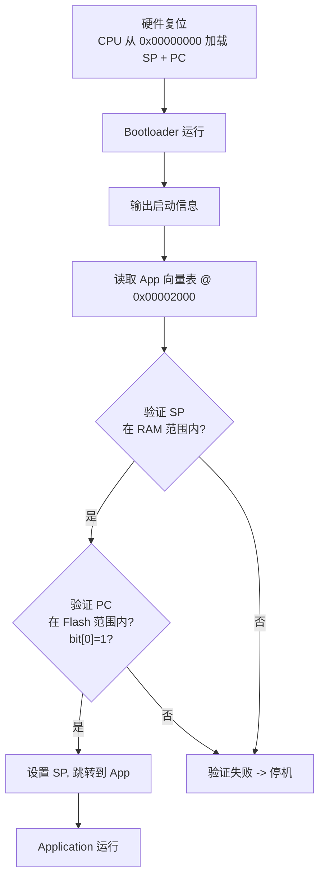

# Lesson 9: Bootloader + Application

## 学习目标

- 理解嵌入式系统的启动流程（Bootloader → Application）
- 掌握双固件编译和 Flash 分区
- 理解 Cortex-M0 无 VTOR 的限制及软件解决方案
- 实现固件合并（boot.bin + app.bin → firmware.bin）

## 架构



### 启动流程



### Cortex-M0 限制

M0 **没有 VTOR 寄存器**（向量表固定在 0x00000000）。这意味着：
- 硬件异常/中断始终通过 Bootloader 的向量表
- App 的向量表不会被硬件使用
- Bootloader 通过手动读取 App 向量表来启动 App
- 对于需要 App 独立处理中断的系统，需要在 Bootloader 的向量表中做转发

> Cortex-M0+ 和 Cortex-M3+ 有 VTOR，App 可以独立设置自己的向量表地址。

## 文件结构

```
lesson_09_bootloader/
├── CMakeLists.txt
├── scripts/merge_firmware.cmake   # 固件合并脚本
├── bootloader/
│   ├── linker/bootloader.ld       # Flash 起始 0x00000000
│   └── src/
│       ├── startup.S
│       └── main.c                 # 验证 + 跳转逻辑
└── app/
    ├── linker/app.ld              # Flash 起始 0x00002000
    └── src/
        ├── startup_app.S          # app_reset_handler
        └── main.c                 # App 主程序
```

## 构建与运行

```bash
cmake -B /tmp/boot_test -S lesson_09_bootloader \
    -DCMAKE_TOOLCHAIN_FILE=cmake/arm-none-eabi-gcc.cmake -G Ninja
cmake --build /tmp/boot_test

# 运行合并固件 (bootloader → app)
cmake --build /tmp/boot_test --target run_firmware

# 单独运行 bootloader (App 不存在, 验证失败)
cmake --build /tmp/boot_test --target run_bootloader
```

## 关键知识点

### 1. 两个独立的链接脚本

Bootloader 和 App 使用不同的 Flash 起始地址，**不能**共享同一个链接脚本。

### 2. App 向量表验证

Bootloader 必须验证 App 的向量表是否有效，防止跳转到随机地址导致 HardFault：

```c
if (app->sp < RAM_START || app->sp > RAM_END) halt();
if (app->pc < APP_START || app->pc > FLASH_END) halt();
if ((app->pc & 1) == 0) halt();  // M0 必须 Thumb 状态
```

### 3. 跳转实现

```c
__asm__ volatile(
    "msr MSP, %0\n"   // SP = App 栈指针
    "bx  %1\n"        // PC = App 复位处理函数
    : : "r"(app_sp), "r"(app_pc) : "memory"
);
```

### 4. 固件合并

`bootloader.bin` + 填充 (0xFF) → 8KB + `app.bin` = `firmware.bin`

- 使用 0xFF 填充（Flash 擦除后的默认状态）
- 最终 firmware.bin 可以直接烧录到硬件

## 运行输出

```
=== Bootloader ===
Addr: 0x00000000 (Flash start)
App vector table @ 0x00002000
App SP = 0x20004000
App PC = 0x000020C5
App validated OK.
Jumping to App...

=== Application ===
Launched by bootloader!
Running from Flash 0x00002000
Current SP = 0x20003FE0

App is running normally.
Sum 1..10 = 0x00000037 (expect 55 / 0x37)

=== Application Complete ===
```

## 相关文档

- [链接脚本指南](../docs/03_linker_script.md)
- [ARM Cortex-M0 汇编指南](../docs/02_assembly.md)
