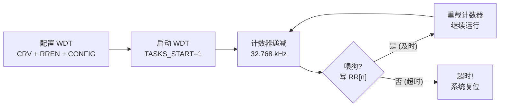

# Lesson 10: Watchdog Timer & System Reliability

## 学习目标

- 理解看门狗定时器（WDT）在嵌入式系统中的必要性
- 掌握 nRF51822 WDT 的配置、启动和喂狗操作
- 理解复位原因寄存器（RESETREAS）的诊断价值
- 学习多点喂狗策略（Multi-Channel Feeding）
- 了解 WDT 与 FreeRTOS 的集成模式

## 文件结构

```
lesson_10_watchdog/
├── CMakeLists.txt
├── linker/microbit.ld
└── src/
    ├── startup.S           # 启动代码
    ├── main.c              # 主程序（6 个演示模块）
    ├── wdt_driver.h        # WDT 驱动接口
    ├── wdt_driver.c        # WDT 驱动实现
    ├── semihosting.h       # Semihosting 辅助
    └── semihosting.c       # Semihosting 实现
```

## 演示内容

| 模块 | 内容 |
|------|------|
| 1 | 复位原因诊断 — 读取并解码 RESETREAS |
| 2 | WDT 基本配置与喂狗 — 初始化 / 启动 / 喂狗流程 |
| 3 | 多点喂狗策略 — 8 个 RR 通道独立监控 |
| 4 | 最佳实践与常见错误 — 喂狗位置 / 超时选择 |
| 5 | WDT + FreeRTOS 集成 — 监控任务 / 空闲钩子 |
| 6 | 超时计算 — CRV 公式 / 常用值 / 选择原则 |

## 关键知识点

### WDT 工作原理



### nRF51 WDT 寄存器

| 寄存器 | 偏移 | 说明 |
|--------|------|------|
| TASKS_START | 0x000 | 写 1 启动 WDT（不可逆） |
| RR[0..7] | 0x100-0x11C | 写 0x6E524635 reload 计数器 |
| CRV | 0x504 | 超时周期（LFCLK ticks） |
| RREN | 0x508 | 使能/禁用 reload 通道 |
| CONFIG | 0x50C | SLEEP/HALT 行为配置 |
| REQSTATUS | 0x600 | 读 reload 请求状态 |

### 超时公式

```
timeout_seconds = (CRV + 1) / 32768

常用值:
  WDT_CRV_1S   = 32767   (1 秒)
  WDT_CRV_2S   = 65535   (2 秒)
  WDT_CRV_5S   = 163839  (5 秒)
  WDT_CRV_10S  = 327679  (10 秒)
```

### 喂狗策略对比

| 策略 | 优点 | 缺点 |
|------|------|------|
| 主循环喂狗 | 简单 | 无法监控单个任务 |
| ISR 中喂狗 | — | **错误!** ISR 可能在线程卡死时仍触发 |
| 多点喂狗 (RR0-RR7) | 每个子系统独立监控 | 需要更多代码 |
| RTOS 监控任务 | 可检测任务心跳 | 需要 RTOS |

### QEMU 限制

- WDT 寄存器可访问（读/写操作正确）
- WDT 计数器可能不递减（QEMU microbit 模型限制）
- WDT 超时复位可能不触发
- 代码逻辑基于 nRF51822 产品规格，对真实硬件正确

## 相关文档

- [nRF51 寄存器指南](../lesson_05_peripherals/inc/nrf51_registers.h)
- [FreeRTOS 指南](../lesson_07_freertos/)
- [ARM Cortex-M0 汇编指南](../docs/02_assembly.md)
