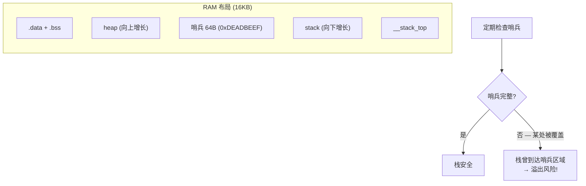

# Lesson 11: Error Handling & Defensive Programming

## 学习目标

- 掌握嵌入式断言系统（ASSERT / ASSERT_ALWAYS / STATIC_ASSERT）
- 理解栈溢出检测原理与栈哨兵实现
- 学习错误码传递模式与统一错误处理框架
- 了解 CRC-32 校验在数据完整性保护中的应用
- 构建可跨复位保留的故障日志（.noinit section）

## 文件结构

```
lesson_11_error_handling/
├── CMakeLists.txt
├── linker/microbit.ld          # 含 .noinit section
└── src/
    ├── startup.S               # 启动代码 (不触碰 .noinit)
    ├── main.c                  # 7 个演示模块
    ├── assert_impl.h / .c      # 断言系统
    ├── error_handler.h / .c    # 错误处理框架
    ├── soft_crc.h / .c         # CRC-32 软件实现
    └── stack_guard.h / .c      # 栈溢出检测
```

## 演示内容

| 模块 | 内容 |
|------|------|
| 1 | 断言系统 — ASSERT / ASSERT_ALWAYS / STATIC_ASSERT |
| 2 | 错误码系统 — 枚举错误码 / 统一记录 / 可读字符串 |
| 3 | 栈溢出检测 — 栈哨兵初始化 / 检查 / SP 边界验证 |
| 4 | 故障日志 — .noinit 跨复位保留 / CRC 验证 / magic 检测 |
| 5 | CRC 数据完整性 — 结构体校验 / 损坏检测 |
| 6 | 防御性编程 — 输入验证 / 超时保护 / 配置 CRC / 栈监控 |
| 7 | 深层调用 — 嵌套函数调用栈使用量演示 |

## 关键知识点

### 断言 vs 错误处理

| | ASSERT | 错误码 |
|------|--------|--------|
| 用途 | 检测程序 bug | 处理运行时错误 |
| 触发后 | 系统停止 | 返回错误码, 继续运行 |
| 适用 | "不可能发生"的条件 | 预期可能发生的故障 |
| 示例 | `ASSERT(ptr != NULL)` | `if (!ptr) return ERR_NULL;` |

### 栈哨兵原理



### CRC-32 数据保护模式

```
写入:  data → crc32(data) → append to data → store
读取:  read data+crc → crc32(data+crc) → == 0x2144DF1C ?
         yes → data intact
         no  → data corrupted → use defaults!
```

### .noinit section

```
普通 .bss: 启动时清零 → 每次复位数据丢失
.noinit:   启动时不触碰 → 软复位/WDT 复位后数据保留

验证方法: magic number + CRC
  if (log.magic == 0xDEADBEEF && crc_ok) → 日志有效
  else → 上电复位/数据损坏, 使用默认值
```

## 相关文档

- [Lesson 10: WDT 看门狗](../lesson_10_watchdog/) — 配合使用: WDT 复位后读取故障日志
- [Lesson 4: 异常处理](../lesson_04_exceptions_interrupts/) — HardFault 栈帧分析
- [ARM Cortex-M0 汇编指南](../docs/02_assembly.md) — SP/栈操作指令
